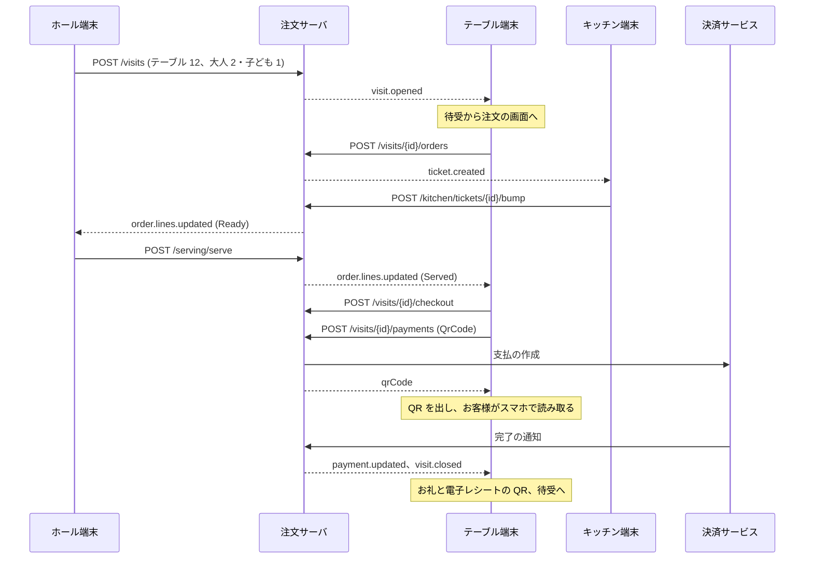

# 注文 API 設計 (想定)

ファミリーレストランのチェーンを運営する会社 (テナント) が契約して使う注文サーバの API の想定で、テーブル端末 (このリポジトリのアプリ) と、店内の注文に関わる端末 (ホール、キッチン、受付) が使う。  
サーバはまだないので、テーブル端末のモック (`MockOrderServer`) とこれから作るサーバはこの文書に合わせる。  
POS の一般の業務とメニューのマスタ管理は扱わず、扱わないものは [§10](#-10-扱わないもの) にまとめた。  
データベースの想定は [database.md](database.md)、画面と実装の計画は [plan.md](plan.md) を参照。

- [1. 前提](#-1-前提)
- [2. 端末と業務](#-2-端末と業務)
- [3. 共通仕様](#-3-共通仕様)
- [4. リソース別 API](#-4-リソース別-api)
- [5. リアルタイム通知](#-5-リアルタイム通知)
- [6. 端末ごとの API](#-6-端末ごとの-api)
- [7. 金額と税](#-7-金額と税)
- [8. エラーコード](#-8-エラーコード)
- [9. 参考にした考え方](#-9-参考にした考え方)
- [10. 扱わないもの](#-10-扱わないもの)

---

## 📐 1. 前提

| 項目 | 内容 |
| --- | --- |
| 業態 | ファミリーレストランのチェーン。店内飲食だけ |
| 範囲 | 注文と、注文に関わる店内の業務 (来店の開始、調理、提供、呼び出し、品切れ、テーブルでの会計) |
| テナント | 複数の会社が契約して使う。テナントの中に店舗を持ち、端末は 1 つの店舗に属する ([§3.6](#36-テナント)) |
| 利用者 | テーブル端末 (お客様) / ホール端末 (スタッフのハンディ) / キッチン端末 (KDS) / 受付機 (任意) / 外部 (本部の管理システム、POS、決済サービス)。店舗と端末の設定は管理画面 (サーバの中の Web の画面) で行う |
| 来店 | テーブルの開始から会計までを 1 つの来店とし、その中に注文が何回か入る。人数は来店に持つ |
| 金額 | 価格は税込 (総額表示)。店内飲食の税率 10% で、会計のときに税率ごとに税額を出す ([§7](#-7-金額と税)) |
| 会計 | テーブル端末で行う (QR コード決済、クレジットカード)。現金はレジ |
| 言語 | 日本語と英語。メニューの名前と説明、呼び出しの用件は両方の言語で返す |
| 特例 | ドリンクバー、お酒、キッズ、数量限定などは、商品とオプションのタグとメニューのルールで表す ([§4.3](#-43-メニュー-menu)) |
| 通知 | 状態の変化はサーバから端末へすぐに知らせる ([§5](#-5-リアルタイム通知)) |
| 実装基盤 | ASP.NET Core。要求は REST (Minimal API)、通知は SignalR。gRPC は必要になってから足す (入口が違っても業務の処理は同じにする) |

---

## 🧩 2. 端末と業務

| 端末 | 使う人・置き場所 | 業務 |
| --- | --- | --- |
| テーブル端末 | お客様 (各テーブル) | メニューを見る、注文、注文履歴、食後の品のお願い、店員の呼び出し、テーブルでの会計 |
| ホール端末 | ホールのスタッフ | 来店の開始 (人数)、人数の変更、テーブルの移動、呼び出しの対応、提供、取消、品切れ、注文の一時停止、代わりの注文、レジで払った来店の終了 |
| キッチン端末 | 厨房・デザート・ドリンクの持ち場 | チケットの表示、作り始め・できあがり・下げる、品切れ |
| 受付機 (任意) | お客様 (入口) | 人数を入れて来店を開く (席はスタッフが決めるか空席から選ぶ) |
| 外部 | 本部の管理システム、POS、決済サービス | メニューの公開、来店の明細と支払の受け取り、決済の完了の通知 |
| 管理画面 | 店長・本部 (サーバの中の Web の画面) | 店舗の設定、テーブル、端末の登録と割り当て、外部のクライアントと Webhook (API を通さない。[§6.7](#67-管理画面)) |

### 2.1 来店と人数

- 人数は来店を開くときに入れる。  
  案内するスタッフがホール端末で入れるか、受付機でお客様が入れ、その来店がテーブルに結び付くとテーブル端末が待受から注文の画面になる
- テーブル端末の登録 (一度だけ。端末を店舗とテーブルに結び付ける) と、来店の開始 (来店ごと) は別のもの
- 受付機もハンディもない店では、店舗の設定 (`selfStart`) でテーブル端末から人数を入れて来店を開けるようにする。  
  ホール端末ができるまでは、テーブル端末のモックはこの形で来店を開く
- 人数は、客数 (客単価の分母)、ドリンクバーの人数分の提案、キッズメニューの表示、割り勘の目安に使う

### 2.2 来店の状態

```
(なし) --来店の開始--> Open --会計を始める--> Paying --支払が揃う--> Closed
                        ^                        |
                        +------会計をやめる-------+
Open --注文のないまま帰った--> Cancelled
Open / Paying --レジで払った (ホール / POS)--> Closed
```

- テーブル端末は、自分のテーブルに `Open` か `Paying` の来店があるときだけ注文の画面を出し、ないときは待受にする
- `Paying` の間は注文を受け付けない (会計の明細が変わらないように)

---

## 🔗 3. 共通仕様

### 3.1 URL・形式

| 項目 | 仕様 |
| --- | --- |
| ベースパス | `/api/v1` (URL のパスでバージョンを分ける) |
| JSON | camelCase。`null` のプロパティは省く。列挙型は文字列 (`"Open"`) |
| 日時 | UTC の `yyyy-MM-ddTHH:mm:ss.fffZ`。営業日は `yyyy-MM-dd`、営業時間と時間帯は店舗の現地時刻の `HH:mm` |
| 金額 (`money`) | `decimal` (円の整数)。価格は税込 |
| 率 (`rate`) | `decimal` (`0.10` = 10%) |
| ID | GUID (すべてのテナントで一意)。端末で起きる登録 (来店、注文、明細、呼び出し、支払) は端末が GUID v7 を採番し、再送で重複しない |
| 言語の文字 (`LocalizedText`) | `{ "ja": "ハンバーグ", "en": "Hamburg Steak" }`。`ja` は必須で、ない言語は `ja` を出す |
| 通信データ | `XxxRequest` / `XxxResponse` (一覧は `XxxListResponse`、要素は `XxxListResponseItem`)。サーバを作るときに共有のプロジェクトに置く |

本書のフィールド名は JSON (camelCase) で書く。  
C# のプロパティ名は PascalCase (`tableId` → `TableId`)。

### 3.2 一覧

- 一覧は `{ "total": 12, "items": [ ... ] }` で返す。  
  店内の業務の一覧 (テーブル、開いているチケット、呼び出し) は件数が少ないので、ページングしない
- 並びはリソースごとに決めた順 (テーブルは表示順、チケットと呼び出しは古い順) にする

### 3.3 書き込み

| 項目 | 仕様 |
| --- | --- |
| 作成 | `POST` (本文に端末が採番した `id`) → `201 Created`。同じ `id` が既にあれば `200 OK` で既存を返し、主な項目が違えば `409` (`DUPLICATE_ID_MISMATCH`) |
| 状態の変更 | `POST /resources/{id}/{動詞}` (例: `/visits/{id}/move`、`/calls/{id}/acknowledge`)。状態に合わなければ `422` |
| 楽観ロック | 来店の変更 (人数、移動、会計の開始と終了) は本文の `version` で確かめ、違えば `409` (`VERSION_MISMATCH`) |
| 検証 | 入力の誤りは `400` (`VALIDATION_ERROR`、`errors` に項目ごと)、業務のルールの違反は `422` |

### 3.4 エラー応答

RFC 9457 の Problem Details に `errorCode` を足す (コードは [§8](#-8-エラーコード))。  
注文の検証で明細ごとの違反があるときは、`errors` のキーを明細の `id` にする。

```jsonc
{
  "title": "売り切れの商品があります",
  "status": 422,
  "errorCode": "ITEM_SOLD_OUT",
  "errors": { "0192c3e0-...": ["売り切れ"] },   // 明細の id ごと
  "traceId": "00-..."
}
```

### 3.5 認証・認可

| 利用者 | 方式 | 使える範囲 |
| --- | --- | --- |
| テーブル端末 | `Authorization: Bearer {アクセストークン}` | 自分のテーブルの来店と、その注文・呼び出し・会計。メニュー・品切れ・店舗の読み取り |
| ホール端末 | アクセストークン | 店舗のすべてのテーブルと来店、注文、提供、呼び出し、品切れ、注文の一時停止 |
| キッチン端末 | アクセストークン | 受け持つ持ち場のチケット、品切れ、メニューと店舗の読み取り |
| 受付機 | アクセストークン | 来店の開始、空いているテーブルの参照 |
| 外部 (本部、POS) | アクセストークン (OAuth 2.0 の client credentials で受け取る) | 本部はメニューの公開と写真、POS はテーブルと会計の参照と来店の終了 (レジで払ったとき)。クライアントごとに範囲 (`scope`) を決める |
| 外部 (決済サービス) | 決済サービスの署名 | 決済の完了の通知 |

端末は自分の鍵で署名して、短命のアクセストークン (JWT) を受け取る。

1. **登録**: 端末は取り出せない鍵 (P-256。Android は Keystore、キッチン端末はブラウザの取り出せない鍵) を作り、`POST /devices/pair` でペアリングコードか登録トークンと公開鍵 (JWK) を送る ([§4.1](#-41-端末-devices))。  
   サーバは端末 (テナント、店舗、種類、置き場所、公開鍵) を記録する
2. **トークン**: 端末は自分の鍵で署名した使い捨ての JWT (期限 5 分以内) を `POST /devices/token` に送り、アクセストークン (JWT、30 分) を受け取る。  
   アクセストークンには端末、テナント、店舗、種類、置き場所 (テーブル、持ち場) を入れ、端末は期限の前に取り直す
3. **要求**: アクセストークンを `Authorization: Bearer` で送る。  
   サーバは署名と期限を確かめるだけで、要求ごとに端末を照会しない。  
   通知のハブ (`/hubs/store`) も同じトークンでつなぐ
4. **取り消し**: 管理画面で端末を無効にすると、次のトークンを出さない (`403` `DEVICE_REVOKED`)。  
   すぐに止めるときは、無効にした端末のトークンを拒み (`401`)、ハブの接続も切る

外部のシステムは、管理画面で発行したクライアント (`client_id` と `client_secret`) で `POST /oauth/token` (OAuth 2.0 の client credentials) を呼び、アクセストークン (JWT、30 分) を受け取る。  
要求と応答は OAuth の決まりの形 (フォームの本文、`access_token`、`expires_in`) にする。  
クライアントは 1 つのテナントに属し、POS のように 1 つの店舗に限ることもできる。

アクセストークンのクレーム:

| クレーム | 端末 | 外部 | 中身 |
| --- | :---: | :---: | --- |
| `iss` / `aud` | ✅ | ✅ | 出したサーバと、この API |
| `sub` | ✅ | ✅ | 端末の `id`。外部はクライアントの `id` |
| `exp` / `iat` | ✅ | ✅ | 期限 (30 分) と出した時刻 |
| `tenant_id` | ✅ | ✅ | テナント ([§3.6](#36-テナント)) |
| `store_id` | ✅ | 店舗に限るクライアント | 店舗 |
| `device_kind` | ✅ | | `Table` / `Hall` / `Kitchen` / `Reception` |
| `table_id` / `station_ids` | テーブル端末 / キッチン端末 | | 置き場所 (テーブル、持ち場) |
| `scope` | | ✅ | 使える範囲 (`menu.publish`、`visits.read`、`visits.close` など) |

- クレームの値はサーバが端末とクライアントの記録から入れ、端末が送った値は使わない
- 署名の鍵は環境ごとに持ち、鍵を替えられるようにトークンに `kid` を付ける (テナントごとには分けない)
- 端末の種類 (`Table` / `Hall` / `Kitchen` / `Reception`) と置き場所の範囲の外の要求は `403` (`DEVICE_SCOPE`)
- `401` を受けた端末は、トークンを取り直して 1 回だけ送り直す。  
  トークンの要求が `DEVICE_REVOKED` で断られたときだけ初期設定に戻る (期限切れや一時的な不具合で店の端末が外れないように)
- 置き場所 (テーブル、持ち場) は端末の記録に持ち、席替えで登録し直さない (次のトークンと `GET /devices/me/config` に出る)
- 取消や来店の終了などスタッフの操作は、任意で `staffId` を付けて記録する (スタッフの管理は扱わない。[§10](#-10-扱わないもの))

### 3.6 テナント

注文サーバは、複数の会社 (テナント) が契約して使う。  
テナントは契約の単位 (チェーンを運営する会社・グループ) で、その中に店舗を持つ。  
端末は 1 つの店舗に、外部のクライアントは 1 つのテナント (か、その中の 1 つの店舗) に属する。

```
テナント ─┬─ 店舗 ─┬─ テーブル、持ち場
          │        └─ 端末
          └─ 外部のクライアント (テナント全体か 1 つの店舗)
```

| 項目 | 決まり |
| --- | --- |
| 見分け方 | テナントと店舗は、アクセストークンのクレーム (`tenant_id`、`store_id`) で決める。URL・ヘッダ・本文にテナントは入れず、店舗を指すのはテナント全体のクライアントだけ (店舗コードで指す)。接続先はすべてのテナントで同じにする (Web の画面のキッチン端末と管理画面も同じ) |
| 認証のあと | 署名・発行者 (`iss`)・対象 (`aud`)・期限を確かめたトークンのテナント・店舗・端末の種類・置き場所は、その要求の間の前提として信用し、要求ごとにデータベースで引き直さない |
| 要求の中の `id` | パス・クエリ・本文の `id` (来店、注文、チケット、支払など) は、トークンのテナントと店舗の中で引く。ほかのテナントや店舗のものは `404` (`NOT_FOUND`) にして、あるかどうかも見せない |
| 店舗の中の範囲 | テーブル端末は自分のテーブル、キッチン端末は受け持つ持ち場の範囲だけを使える。範囲の外は `403` (`DEVICE_SCOPE`) |
| 一意の範囲 | `id` (GUID) はすべてのテナントで一意。店舗コードと商品コードはテナントの中、テーブルの名前は店舗の中で一意 |
| 匿名の要求 | 端末の登録 (`POST /devices/pair`) はトークンがないので、ペアリングコードと登録トークンをすべてのテナントで一意にし、そこからテナントと店舗を決める |
| 外部のクライアント | 複数のテナントとつなぐ相手は、テナントごとにクライアントを持つ。テナント全体のクライアントは、店舗をテナントの中の店舗コードで指す (メニューの公開の `storeCodes`) |
| 決済サービスの通知 | 取引番号で支払を引き、その支払のテナントの決済サービスの設定で署名を確かめる (要求の中のテナントの値は使わない) |
| 通知 | ハブはトークンの店舗の通知だけを送り、どの通知を受けるかを端末に選ばせない。Webhook はテナントごとに送り先を登録し、本文にテナントと店舗を付ける |
| 管理画面 | 利用者はテナントに属し、自分のテナントだけを扱う。サービスの運営者は、テナントを選んで扱う ([§6.7](#67-管理画面)) |
| 上限 | 要求の数を端末・クライアントごとと、テナントごとに限る (`429`)。1 つのテナントの負荷で、ほかのテナントを遅くしない |
| 記録 | ログ・メトリクス・トレースにテナントと店舗を付ける (問い合わせの調べと、テナントごとの使用量のため) |
| 停止 | 契約を止めたテナントにはトークンを出さず (`403` `TENANT_SUSPENDED`)、出したトークンも拒む (`401`) |
| 専用の環境 | 大きなテナントを別の環境に分けるときも API は変えず、接続先 (EMM で配る `apiEndPoint`) を替える |

トークンのテナントを信用するために、次のことを守る。

- トークンは 30 分で切れる。  
  置き場所の変更 (席替え、持ち場) と契約の変更は、次のトークンで反映する
- すぐに止めるもの (端末の無効化、テナントの停止) は、サーバが覚えている一覧で要求ごとに拒む (データベースは引かない)
- テナントがあって止まっていないかは、トークンを出すときに確かめる
- トークンを信用していても、要求の中の `id` は毎回テナントと店舗で絞って引く (オブジェクト単位の認可)
- 業務の処理はテナントと店舗を要求の文脈で受け取り、データの読み書きで必ず絞る (データベースはすべての表に `TenantId` を持つ。[database.md](database.md#テナントの持ち方))。  
  絞り忘れは、SQL がテナントで絞っているかを調べるテストで見つける

---

## 🌐 4. リソース別 API

各表の「利用者」: テーブル / ホール / キッチン / 受付 / 外部 ([§3.5](#35-認証認可))。  
フィールドの表は応答の項目。

### 📱 4.1 端末 (Devices)

| フィールド | 型 | 説明 |
| --- | --- | --- |
| `id` | guid | |
| `storeId` | guid | |
| `kind` | enum | `Table` / `Hall` / `Kitchen` / `Reception` |
| `name` | string(50) | 例: `T12`、`ハンディ 1`、`キッチン 1` |
| `tableId` | guid? | テーブル端末の置き場所 (管理画面で替える) |
| `stationIds` | guid[] | キッチン端末が受け持つ持ち場 |
| `appVersion` | string(50)? | 端末が送る (登録と状態の報告) |
| `batteryLevel` | rate? | 電池の残り (`0`〜`1`)。充電が切れそうなテーブル端末に気付くため |
| `isCharging` | bool? | |
| `lastSeenAt` | datetime? | 最後に通信した時刻 (サーバが付ける) |
| `isActive` | bool | |

| Method | Path | 利用者 | 概要 |
| --- | --- | --- | --- |
| POST | `/devices/pair` | 全端末 (匿名) | 端末の登録 `DevicePairRequest { pairingCode か enrollmentToken, publicKey, deviceName, appVersion }` → `201` `DevicePairResponse { deviceId, kind, storeId }`。コードの不一致・期限切れ・使用済みは `422` (`PAIRING_CODE_INVALID`)。接続元ごとに 1 分 10 回まで |
| POST | `/devices/token` | 全端末 (端末の鍵の署名) | アクセストークンの取得 `DeviceTokenRequest { assertion }` (端末の鍵で署名した JWT) → `200` `DeviceTokenResponse { accessToken, expiresIn }`。無効にした端末は `403` (`DEVICE_REVOKED`) |
| POST | `/devices/me/heartbeat` | 全端末 | 端末の状態 `DeviceHeartbeatRequest { appVersion, batteryLevel, isCharging }` → `204`。1 分ごと |
| GET | `/devices/me/config` | 全端末 | 端末の設定 (`DeviceConfigResponse`)。起動のときと `store.updated` を受けたときに読む |

ペアリングコード (6 桁、10 分、一度だけ) は管理画面で発行し、そのときに端末の種類と置き場所 (テーブル、持ち場) を決める。  
専用端末として EMM から配るときは、管理対象の構成 (Managed configurations) で接続先と登録トークン (店舗と種類に限った数日有効のもの) を渡し、端末が起動したときに自分で登録する。  
登録トークンで登録した端末の置き場所は、管理画面で割り当てる。

`DeviceConfigResponse` の項目:

| フィールド | 型 | 説明 |
| --- | --- | --- |
| `storeName` | LocalizedText | 店舗の名前 (チェーンの名前は端末の文言に持つ) |
| `languages` | string[] | 画面で選べる言語 (`["ja", "en"]`) |
| `orderRules` | object | `maxQuantityPerLine` (1 明細の数量の上限)、`maxLinesPerOrder` (1 回の注文の明細の上限)、`selfStart` (テーブル端末から来店を開けるか) |
| `paymentMethods` | enum[] | テーブルで使える支払方法 (`QrCode` / `CreditCard`)。空ならテーブルでは会計せず、レジに案内する |
| `callReasons` | object[] | 呼び出しの用件 `{ code, name (LocalizedText), sortOrder }` (店舗で選べる。[§4.9](#-49-呼び出し-calls)) |
| `electronicReceipt` | bool | 電子レシートを出すか |
| `taxRounding` | enum | 税額の端数 (§4.2) |
| `device` | object | 端末 `{ id, kind, name, tableId, tableName, stationIds }` (§4.1)。置き場所はここで受け取る |
| `theme` | object | 色の役割の名前と色 (`{ "PrimaryColor": "#C53D13", ... }`)。端末の `Colors.xaml` と同じ名前で、ない役割は端末の既定のまま。ブランド色を替える仕組みを作るときに足す |

お酒の年齢の確認やドリンクバーの人数分の提案は、店舗の設定ではなくメニューのルール ([§4.3](#-43-メニュー-menu)) で決める。

### 🏪 4.2 店舗とテーブル (Store / Tables)

店舗:

| フィールド | 型 | 説明 |
| --- | --- | --- |
| `id` | guid | |
| `code` | string(10) | 店舗コード (POS と合わせる) |
| `name` | LocalizedText | |
| `timeZone` | string(50) | `Asia/Tokyo` |
| `businessDate` | date | 今の営業日 |
| `openTime` / `closeTime` | string | `HH:mm`。開店の時刻を営業日の区切りにし、閉店が開店より前なら日をまたぐ |
| `lastOrderTime` | string? | `HH:mm`。過ぎたら注文を受け付けない (`422` `LAST_ORDER_PASSED`)。ラストオーダーのない店は null |
| `orderingPaused` | bool | 注文の一時停止 (厨房が追いつかないときなど) |
| `pausedMessage` | LocalizedText? | 一時停止の間にテーブル端末に出す文言 |
| `taxRounding` | enum | `Floor` / `Round` / `Ceiling`。税額の端数 (既定 `Floor`) |

テーブル:

| フィールド | 型 | 説明 |
| --- | --- | --- |
| `id` | guid | |
| `name` | string(10) | 例: `12` |
| `area` | string(20)? | 例: `窓側`、`2F` |
| `capacity` | int | 席の数 |
| `sortOrder` | int | |
| `visit` | object? | 今の来店の要約 `{ visitId, adults, children, status, openedAt, lastOrderedAt, unservedCount, openCallCount }` (ホールの席の一覧のため) |

| Method | Path | 利用者 | 概要 |
| --- | --- | --- | --- |
| GET | `/store` | 全端末 | 店舗 (`StoreResponse`) |
| PUT | `/store/ordering` | ホール | 注文の一時停止と再開 `StoreOrderingRequest { paused, message? }` → `204`。通知 `store.updated` |
| GET | `/tables?status` | ホール / 受付 / 外部 (POS) | テーブルと今の来店の要約 (`TableListResponse`)。`status` = `Vacant` / `Occupied` / `Paying` |

### 📖 4.3 メニュー (Menu)

店舗で出すメニュー全体を 1 回で返す。  
メニューの編集は本部の管理システムで行い、公開した結果をこの API で配る ([§10](#-10-扱わないもの))。

| Method | Path | 利用者 | 概要 |
| --- | --- | --- | --- |
| GET | `/menu` | テーブル / ホール / キッチン | メニュー (`MenuResponse`)。`If-None-Match` に `menuVersion` を付けると、変わっていなければ `304` |
| GET | `/menu/images/{name}` | テーブル / ホール / キッチン | 料理の写真。名前は内容が変わると変わるので、端末は保存して使い回す |
| PUT | `/menu/images/{name}` | 外部 (本部) | 料理の写真を置く (`image/jpeg` / `image/webp`) → `204`。公開の前に置き、商品の `imageName` で指す |
| POST | `/menu/publications` | 外部 (本部) | 本部で編集したメニューの公開 `MenuPublishRequest { storeCodes, menu }` (`menu` は `MenuResponse` から `menuVersion` を除いた形) → `202` `{ menuVersion }`。通知 `menu.published` |

`MenuResponse` の項目:

| フィールド | 型 | 説明 |
| --- | --- | --- |
| `menuVersion` | string | 公開のたびに変わる |
| `categories` | object[] | カテゴリ (タブ) `{ id, name (LocalizedText), sortOrder, tags, itemIds }`。`itemIds` は表示順。1 つの商品が複数のカテゴリ (おすすめと本来のカテゴリ) に入ってよい |
| `items` | object[] | 商品 (下の表) |
| `optionGroups` | object[] | オプションの組 (下の表) |
| `tags` | object[] | タグ `{ code, name (LocalizedText) }` (`drink-bar`、`alcohol`、`kids`、`dessert`、`one-per-guest` など) |
| `rules` | object[] | タグに対するルール (下の表) |
| `allergens` | object[] | アレルギーの表示に使う原材料 `{ code, name (LocalizedText), isMandatory }`。特定原材料の 8 品目 (えび、かに、くるみ、小麦、そば、卵、乳、落花生) は `isMandatory` |
| `stations` | object[] | 持ち場 `{ id, name, sortOrder }` (キッチン、デザート、ドリンク) |

時間帯で出す品 (モーニング、ランチ) は、時間帯 (`dayparts`) とカテゴリ・商品の結び付けとして後で足す。

商品 (`MenuResponseItem`):

| フィールド | 型 | 説明 |
| --- | --- | --- |
| `id` | guid | |
| `code` | string(20) | 商品コード (POS と合わせる) |
| `name` / `description` | LocalizedText | |
| `price` | money | 税込 |
| `taxRate` | rate | `0.10` |
| `imageName` | string? | 写真 (`/menu/images/{name}`) |
| `badges` | enum[] | `Recommended` / `Popular` / `New` / `Limited` |
| `spiceLevel` | int | 辛さ (`0`〜`3`) |
| `allergenCodes` | string[] | 含む原材料 |
| `calories` | int? | kcal |
| `tags` | string[] | タグ (ルールの対象を決める。`alcohol`、`drink-bar` など) |
| `stationId` | guid? | 作る持ち場。`null` は作らない品 |
| `servedBy` | enum | `Staff` (スタッフが運ぶ) / `Guest` (お客様が自分でとる。ドリンクバーなど) |
| `optionGroupIds` | guid[] | 選べるオプションの組 (表示順) |
| `maxQuantity` | int? | 1 明細の数量の上限 (店舗の上限より厳しくするとき) |
| `defaultTiming` | enum | 出す時機の既定 `Now` / `AfterMeal` (デザートは食後) |
| `timingSelectable` | bool | お客様が出す時機 (すぐに / 食後に) を選べるか |

オプションの組 (`MenuResponseOptionGroup`):

| フィールド | 型 | 説明 |
| --- | --- | --- |
| `id` | guid | |
| `name` | LocalizedText | 例: ソース、セット、焼き加減 |
| `minSelect` / `maxSelect` | int | 選ぶ数。`0` / `1` は任意の 1 つ、`1` / `1` は必須の 1 つ |
| `options` | object[] | `{ id, name (LocalizedText), priceDelta, isDefault, tags, allergenCodes }`。`priceDelta` は税込の差額 (`0` 以上) |

ルール (`MenuResponseRule`):

| フィールド | 型 | 説明 |
| --- | --- | --- |
| `id` | guid | |
| `kind` | enum | `Suggestion` (提案) / `Confirmation` (確認) / `Limit` (上限) |
| `targetTag` | string | 対象のタグ。商品かオプションにタグがあれば対象になる |
| `basis` | enum? | 提案で比べる人数 `Guests` / `Adults` / `Children` |
| `suggestItemIds` | guid[]? | 提案する商品 |
| `scope` | enum? | 数える範囲 `Order` (注文ごと) / `Visit` (来店で 1 回、来店の合計) / `Guest` (1 人あたり × 人数) |
| `max` | int? | 上限の数 |
| `message` | LocalizedText? | お客様に出す文言 (提案と確認) |

| ルール | テーブル端末 | サーバ |
| --- | --- | --- |
| 提案 (`Suggestion`) | 注文の確認で、タグの品を誰かが頼んでいて人数より少なければ、提案する商品を 1 枠で出す | 何もしない |
| 確認 (`Confirmation`) | タグの品を入れる前に `message` で確かめ、答えを記録する (`POST /visits/{id}/confirmations`) | 記録のない来店の注文は `422` (`CONFIRMATION_REQUIRED`) |
| 上限 (`Limit`) | 来店の注文とカートを合わせて上限を超えたら入れない | 超える注文は `422` (`LIMIT_EXCEEDED`) |

数え方 (人数の取り方、足りない数、上限) は端末とサーバで同じ計算 (`TableOrder.Domain.TagRules`) を使う。  
例えばドリンクバーは、単品の商品 (ドリンクバー、キッズドリンクバー) と料理のセットのオプション (セットドリンクバー) に `drink-bar` のタグを付け、提案のルール (`basis` = `Guests`) で人数分を提案する。  
お酒は `alcohol` のタグと確認のルール (`scope` = `Visit`) で、来店で 1 回だけ年齢を確かめる。

```jsonc
{
  "menuVersion": "2026-10-01T02:00:00.000Z-17",
  "categories": [
    { "id": "...", "name": { "ja": "ハンバーグ・ステーキ", "en": "Hamburg & Steak" }, "sortOrder": 2, "tags": [], "itemIds": ["..."] }
  ],
  "items": [
    {
      "id": "...", "code": "1012",
      "name": { "ja": "チーズインハンバーグ", "en": "Cheese-filled Hamburg Steak" },
      "price": 999, "taxRate": 0.10, "badges": ["Popular"],
      "allergenCodes": ["wheat", "egg", "milk"], "calories": 820, "tags": [],
      "stationId": "...", "servedBy": "Staff", "optionGroupIds": ["... (ソース)", "... (セット)", "... (ドリンク)"],
      "defaultTiming": "Now", "timingSelectable": false
    },
    {
      "id": "...", "code": "6001", "name": { "ja": "ドリンクバー", "en": "Drink Bar" }, "price": 459, "taxRate": 0.10,
      "tags": ["drink-bar"], "stationId": null, "servedBy": "Guest", "defaultTiming": "Now"
    }
  ],
  "optionGroups": [
    {
      "id": "...", "name": { "ja": "ドリンク", "en": "Drink" }, "minSelect": 0, "maxSelect": 1,
      "options": [
        { "id": "...", "name": { "ja": "セットドリンクバー", "en": "Drink Bar (set)" }, "priceDelta": 299, "tags": ["drink-bar"] }
      ]
    }
  ],
  "tags": [ { "code": "drink-bar", "name": { "ja": "ドリンクバー", "en": "Drink bar" } } ],
  "rules": [
    {
      "id": "...", "kind": "Suggestion", "targetTag": "drink-bar", "basis": "Guests", "suggestItemIds": ["... (ドリンクバー)", "... (キッズドリンクバー)"],
      "message": { "ja": "ドリンクバーを人数分にしますか？", "en": "Would you like drink bar for everyone?" }
    },
    { "id": "...", "kind": "Confirmation", "targetTag": "alcohol", "scope": "Visit", "message": { "ja": "20 歳以上で、お車を運転されない方のご注文ですか？" } },
    { "id": "...", "kind": "Limit", "targetTag": "one-per-guest", "scope": "Guest", "max": 1 }
  ],
  "allergens": [ { "code": "wheat", "name": { "ja": "小麦", "en": "Wheat" }, "isMandatory": true } ],
  "stations": [ { "id": "...", "name": "キッチン", "sortOrder": 1 } ]
}
```

### ⛔ 4.4 品切れ (Stock)

商品とオプションごとに、売れるかどうかと残りの数を持つ。

| フィールド | 型 | 説明 |
| --- | --- | --- |
| `targetId` | guid | 商品かオプションの `id` |
| `targetKind` | enum | `Item` / `Option` |
| `status` | enum | `Available` / `Limited` (残りの数がある) / `SoldOut` |
| `remaining` | int? | 残りの数 (`Limited` のときだけ) |
| `updatedAt` | datetime | |

| Method | Path | 利用者 | 概要 |
| --- | --- | --- | --- |
| GET | `/stock` | テーブル / ホール / キッチン | `Available` でないものの一覧 (`StockResponse`) |
| PUT | `/stock/{targetId}` | ホール / キッチン | 品切れ・残りの数の設定 `StockUpdateRequest { targetKind, status, remaining? }` → `204`。通知 `stock.updated` |
| POST | `/stock/reset` | ホール | すべて `Available` に戻す (営業日の始めなど) |

- `Limited` の残りの数は、注文を受けるたびにサーバが減らし、`0` になったら `SoldOut` にする
- 品切れの品の注文は `422` (`ITEM_SOLD_OUT`)、残りの数を超える注文は `422` (`STOCK_INSUFFICIENT`)

### 🪑 4.5 来店 (Visits)

| フィールド | 型 | 説明 |
| --- | --- | --- |
| `id` | guid | 来店を開いた端末が採番 |
| `tableId` / `tableName` | guid / string | |
| `adults` / `children` | int | 大人 / 子ども (小学生以下)。合わせて 1 以上 |
| `status` | enum | `Open` / `Paying` / `Closed` / `Cancelled` ([§2.2](#22-来店の状態)) |
| `openedBy` | enum | `Hall` / `Reception` / `Table` (お客様がテーブル端末で開いた) |
| `openedAt` / `closedAt` | datetime | |
| `closedBy` | enum? | `TablePayment` (テーブルで払った) / `Register` (レジで払った) / `Hall` |
| `businessDate` | date | |
| `confirmedRuleIds` | guid[] | 答えた確認のルール (お酒の年齢の確認など) |
| `orderTotal` | money | 注文の合計 (取消を除く) |
| `version` | int | |

| Method | Path | 利用者 | 概要 |
| --- | --- | --- | --- |
| POST | `/visits` | ホール / 受付 / テーブル (`selfStart` のとき) | 来店の開始 `VisitCreateRequest { id, tableId, adults, children }` → `201`。テーブル端末は `tableId` を省く (端末の置き場所)。テーブルに `Open` / `Paying` の来店があれば `409` (`TABLE_OCCUPIED`)。通知 `visit.opened` |
| GET | `/visits/{id}` | テーブル (自分の来店) / ホール / 外部 (POS) | 来店 |
| GET | `/devices/me/visit` | テーブル | 自分のテーブルの今の来店。なければ `204` (待受にする) |
| PATCH | `/visits/{id}` | ホール | 人数の変更 `VisitUpdateRequest { adults, children, version }` |
| POST | `/visits/{id}/move` | ホール | テーブルの移動 `{ toTableId, version }`。移動先に来店があれば `409` (`TABLE_OCCUPIED`)。通知 `visit.moved` (元のテーブル端末は待受に、移動先は注文の画面になる) |
| POST | `/visits/{id}/confirmations` | テーブル | 確認のルールに答えた記録 `VisitConfirmationRequest { ruleId }` → `200` (来店) |
| POST | `/visits/{id}/close` | ホール / 外部 (POS) | レジで払ったなど、テーブルの外で会計した来店を終える `{ closedBy, version, staffId? }`。通知 `visit.closed` |
| POST | `/visits/{id}/cancel` | ホール | 注文のないまま帰った来店の取りやめ `{ version }`。注文があれば `422` (`VISIT_HAS_ORDERS`) |

### 🧾 4.6 注文 (Orders)

1 回の「注文を確定する」で送る明細の束を注文とする。  
明細は調理と提供の状態を持つ。

注文 (`OrderListResponseItem`):

| フィールド | 型 | 説明 |
| --- | --- | --- |
| `id` | guid | 送った端末が採番 |
| `visitId` | guid | |
| `orderNo` | int | 来店の中の通し番号 (1、2、...) |
| `source` | enum | `Table` / `Hall` (スタッフが代わりに入れた) |
| `deviceId` | guid | |
| `orderedAt` | datetime | |
| `amount` | money | 明細の合計 (取消を除く) |
| `lines` | object[] | 明細 (下の表) |

明細 (`OrderListResponseLine`):

| フィールド | 型 | 説明 |
| --- | --- | --- |
| `id` | guid | 送った端末が採番 |
| `itemId` | guid | |
| `name` | LocalizedText | 注文したときの名前 (メニューが変わっても履歴の表示を変えない) |
| `options` | object[] | `{ optionGroupId, optionId, name (LocalizedText), priceDelta }` |
| `quantity` | int | |
| `unitPrice` | money | 税込。商品の価格 + オプションの差額 |
| `amount` | money | `unitPrice × quantity` |
| `taxRate` | rate | |
| `timing` | enum | `Now` / `AfterMeal` (食後) |
| `status` | enum | `Held` / `Ordered` / `Cooking` / `Ready` / `Served` / `Cancelled` (下の図) |
| `stationId` | guid? | |
| `servedAt` / `cancelledAt` | datetime? | |
| `cancelReason` | string(100)? | |

```
Held (食後まで止めている) --お願いする--> Ordered --作り始め--> Cooking --できあがり--> Ready --提供--> Served
お客様がとる品 (ドリンクバー) は注文を受けたときに Served、作らない品 (持ち場なし) でスタッフが運ぶものは Ready にする
Held / Ordered / Cooking / Ready --取消 (ホール)--> Cancelled
```

`OrderCreateRequest`:

```jsonc
{
  "id": "0192c3e0-...",                  // 端末が採番 (GUID v7)。再送しても重複しない
  "menuVersion": "2026-10-01T02:00:00.000Z-17",   // 表示していたメニュー
  "lines": [
    { "id": "0192c3e1-...", "itemId": "... (チーズインハンバーグ)", "optionIds": ["... (デミグラス)", "... (ライス・スープ)", "... (セットドリンクバー)"], "quantity": 2, "unitPrice": 1628, "timing": "Now" },
    { "id": "0192c3e2-...", "itemId": "... (いちごパフェ)", "optionIds": [], "quantity": 1, "unitPrice": 699, "timing": "AfterMeal" }
  ]
}
```

| Method | Path | 利用者 | 概要 |
| --- | --- | --- | --- |
| POST | `/visits/{visitId}/orders` | テーブル / ホール | 注文の送信 `OrderCreateRequest` → `201` (`OrderListResponseItem`)。同じ `id` の再送は `200`。通知 `order.created`、`ticket.created` |
| GET | `/visits/{visitId}/orders` | テーブル / ホール | 来店の注文 (`OrderListResponse`)。注文履歴と明細の状態 |
| POST | `/visits/{visitId}/orders/release` | テーブル / ホール | 食後の品をお願いする `OrderReleaseRequest { lineIds }` (空ならすべて) → `Held` を `Ordered` にする。通知 `order.lines.updated`、`ticket.created` |
| POST | `/orders/{orderId}/lines/{lineId}/cancel` | ホール | 取消 `{ quantity, reason, staffId? }`。数量の一部の取消は明細を分けて取り消す。`Served` の明細は `422` (`LINE_STATUS_INVALID`) |

注文を受けるときにサーバが確かめること:

- 来店が `Open` (`Paying` は `422` `CHECKOUT_IN_PROGRESS`、終わった来店は `422` `VISIT_NOT_OPEN`)
- 店舗が一時停止していない (`ORDERING_PAUSED`)、ラストオーダーを過ぎていない (`LAST_ORDER_PASSED`)
- メニューが変わって価格が違えば `MENU_CHANGED` (端末はメニューを読み直して確かめ直してもらう)
- 品切れ・残りの数 (`ITEM_SOLD_OUT` / `STOCK_INSUFFICIENT`)、時間帯 (`ITEM_UNAVAILABLE`)、オプションの数と組み合わせ (`OPTION_INVALID`)、数量と明細の数の上限 (`QUANTITY_EXCEEDED`)
- 確認のルールの対象の品は来店の記録 (`CONFIRMATION_REQUIRED`)、上限のルールは来店のこれまでの注文と合わせた数 (`LIMIT_EXCEEDED`)
- 注文の取消はお客様にはさせない (テーブル端末からは呼び出しでスタッフに頼む)

### 🍳 4.7 キッチン (Kitchen)

注文の明細を持ち場ごとに分けたものをチケットとし、キッチン端末に出す。

| フィールド | 型 | 説明 |
| --- | --- | --- |
| `id` | guid | |
| `stationId` | guid | |
| `orderId` / `visitId` | guid | |
| `tableName` | string | |
| `orderNo` | int | |
| `createdAt` | datetime | チケットができた時刻 (食後の品はお願いされた時刻) |
| `status` | enum | `Open` / `Done` (下げた) |
| `lines` | object[] | `{ lineId, name (日本語), options (日本語), quantity, status }` |

| Method | Path | 利用者 | 概要 |
| --- | --- | --- | --- |
| GET | `/kitchen/tickets?stationId&status` | キッチン | チケットの一覧 (`KitchenTicketListResponse`。`status` の既定は `Open` で古い順。`Done` は下げた新しい順に直近のもの) |
| POST | `/kitchen/tickets/{id}/lines/{lineId}/start` | キッチン | 作り始め (`Cooking`) |
| POST | `/kitchen/tickets/{id}/lines/{lineId}/ready` | キッチン | できあがり (`Ready`) |
| POST | `/kitchen/tickets/{id}/bump` | キッチン | すべての明細をできあがりにして下げる (`Done`) |
| POST | `/kitchen/tickets/{id}/recall` | キッチン | 下げたチケットを戻す (押し間違い)。まだ出していない明細は `Cooking` に戻す |

明細の状態が変わると `order.lines.updated` を送り、テーブル端末の注文履歴とホール端末の提供の一覧に出す。

### 🍛 4.8 提供 (Serving)

| Method | Path | 利用者 | 概要 |
| --- | --- | --- | --- |
| GET | `/serving?status` | ホール | 提供を待つ明細をテーブルごとに (`ServingListResponse`。`status` の既定は `Ready`) |
| POST | `/serving/serve` | ホール | 提供した `{ lineIds, staffId? }` → `Served`。通知 `order.lines.updated` |

### 🙋 4.9 呼び出し (Calls)

| フィールド | 型 | 説明 |
| --- | --- | --- |
| `id` | guid | テーブル端末が採番 |
| `visitId` / `tableId` / `tableName` | | |
| `reasonCode` | string(20) | 用件 (下の表) |
| `status` | enum | `Open` / `Acknowledged` (向かっている) / `Done` |
| `createdAt` / `acknowledgedAt` / `doneAt` | datetime | |

用件の例 (店舗の設定で選ぶ): `Staff` (店員を呼ぶ)、`Water` (お水)、`Plates` (取り皿)、`Cutlery` (スプーン・フォーク)、`KidsTableware` (子ども用の食器)、`Clear` (お皿を下げる)、`Payment` (会計の相談)。

| Method | Path | 利用者 | 概要 |
| --- | --- | --- | --- |
| POST | `/visits/{visitId}/calls` | テーブル | 呼び出し `{ id, reasonCode }` → `201`。同じ用件の終わっていない (`Open` / `Acknowledged`) 呼び出しがあれば `200` でそれを返す (続けて押しても増やさない)。通知 `call.created` |
| GET | `/visits/{visitId}/calls` | テーブル | 来店の呼び出しと状態 |
| GET | `/calls?status` | ホール | 呼び出しの一覧 (古い順。`status` の既定は `Open` と `Acknowledged`) |
| POST | `/calls/{id}/acknowledge` | ホール | 向かう (`Acknowledged`)。テーブル端末に「スタッフが向かっています」と出す |
| POST | `/calls/{id}/done` | ホール | 対応した (`Done`) |

### 💳 4.10 会計 (Bill / Payments)

テーブル端末で明細を確かめ、QR コード決済かクレジットカードで払う。  
決済の処理そのものは決済サービスが行い、注文サーバは支払の開始と結果を記録して、支払が揃ったら来店を終える。

会計 (`BillResponse`):

| フィールド | 型 | 説明 |
| --- | --- | --- |
| `visitId` | guid | |
| `billVersion` | string | 明細が変わると変わる |
| `lines` | object[] | `{ name, options, quantity, unitPrice, amount, taxRate }` (同じ商品・オプションはまとめる。取消を除く) |
| `subtotal` | money | 税込の合計 |
| `taxes` | object[] | 税率ごとの `{ rate, taxableAmount, taxAmount }` (内税) |
| `total` | money | |
| `paidAmount` / `balance` | money | 払った額 / 残り |
| `guests` | int | 大人 + 子ども |
| `splitAmounts` | money[] | 人数で割った目安 ([§7](#-7-金額と税)) |
| `hasUnservedLines` | bool | まだ出していない品がある (会計の前に確かめてもらう) |

支払 (`PaymentResponse`):

| フィールド | 型 | 説明 |
| --- | --- | --- |
| `id` | guid | テーブル端末が採番 |
| `visitId` | guid | |
| `method` | enum | `QrCode` / `CreditCard` |
| `amount` | money | |
| `status` | enum | `Pending` / `Completed` / `Failed` / `Cancelled` |
| `qrCode` | string? | 店舗が見せる QR の内容 (`QrCode` のとき。サーバが決済サービスから受け取る) |
| `expiresAt` | datetime? | QR の期限 |
| `provider` / `providerReference` | string? | 決済サービスと、その取引番号 |
| `completedAt` | datetime? | |

| Method | Path | 利用者 | 概要 |
| --- | --- | --- | --- |
| GET | `/visits/{visitId}/bill` | テーブル / ホール / 外部 (POS) | 会計の明細と合計 (`BillResponse`) |
| POST | `/visits/{visitId}/checkout` | テーブル / ホール | 会計を始める `{ billVersion, version }` → 来店を `Paying` にする。`billVersion` が違えば `422` (`BILL_CHANGED`)。通知 `visit.updated` (ホールの席の一覧に「会計中」) |
| POST | `/visits/{visitId}/checkout/cancel` | テーブル / ホール | 会計をやめる `{ version }` (支払がなければ `Open` に戻す) |
| POST | `/visits/{visitId}/payments` | テーブル | 支払を始める `PaymentCreateRequest { id, method, amount }` → `201` (`PaymentResponse`)。`QrCode` は `qrCode` を返し、`CreditCard` はテーブルの決済端末で払う |
| POST | `/payments/{id}/result` | テーブル | 決済端末で払った結果 `{ status, provider, providerReference }` (`CreditCard`) |
| POST | `/payments/callbacks/{provider}` | 外部 (決済サービス) | 決済の完了の通知 (`QrCode`)。署名を確かめる |
| GET | `/payments/{id}` | テーブル | 支払の状態 (通知を受け損ねたとき) |
| POST | `/payments/{id}/cancel` | テーブル | 待っている支払をやめる (`Pending` だけ) |
| GET | `/visits/{visitId}/receipt` | テーブル | 領収の内容と電子レシートの URL (`ReceiptResponse`。画面に QR で出す) |

- 支払は残り (`balance` から、期限内の待っている支払も引いた額) を超えない (`422` `PAYMENT_AMOUNT_INVALID`)。  
  割り勘は、目安の額で支払を何回かに分けて行う
- 支払が揃う (`balance` = 0) と、来店を `Closed` (`closedBy` = `TablePayment`) にして `visit.closed` を送る。  
  テーブル端末はお礼と電子レシートの QR を出し、待受に戻る
- 現金はテーブルで扱わない。  
  テーブル端末は「レジでお支払いください」と出し、レジ (POS) かホール端末が `POST /visits/{id}/close` で来店を終える

---

## 📡 5. リアルタイム通知

### 5.1 接続

- 端末は WebSocket (`/hubs/store`。ASP.NET Core SignalR) にアクセストークンでつなぐ。  
  サーバはトークンの店舗の通知のうち、端末の種類と置き場所に合うものだけを送る。  
  要求を gRPC にするときは、同じ通知を gRPC のサーバストリームでも出す
- 端末の状態 (電池、アプリの版) は `POST /devices/me/heartbeat` で送り、つながっているかはハブの接続で見る。  
  テレメトリ (ログ、メトリクス、トレース) は OpenTelemetry (OTLP) で送る
- 通知は `{ "seq": 1234, "type": "visit.opened", "occurredAt": "...", "data": { ... } }`。  
  `seq` は店舗の中で増える通し番号
- 切れてつなぎ直したときは `GET /events?after={最後に受けた seq}` で抜けた分を受け取る。  
  残している範囲 (24 時間) より前なら `410` (`EVENTS_EXPIRED`) を返すので、端末は今の状態を読み直す
- 通知は `seq` の順に送る。  
  同じ通知が 2 回届くことがあるので、端末は最後に受けた `seq` 以前の通知を捨てる

### 5.2 通知の種類

| `type` | 送る先 | `data` | 受けた端末の動き |
| --- | --- | --- | --- |
| `visit.opened` | そのテーブル端末、ホール、受付 | 来店 | テーブル端末は待受から注文の画面にする。受付機は空席から外す |
| `visit.updated` | そのテーブル端末、ホール | 来店 | 人数・状態 (会計中) の表示を変える |
| `visit.moved` | 元と移動先のテーブル端末、ホール、受付 | 来店、元のテーブル | 元は待受に、移動先は注文の画面にする。受付機は空席を替える |
| `visit.closed` | そのテーブル端末、ホール、受付 | 来店 | テーブル端末は待受に戻る (お会計の画面ならお礼を出してから)。受付機は空席に戻す |
| `order.created` | ホール、そのテーブル端末 | 注文 | 席の一覧と注文履歴に足す |
| `order.lines.updated` | そのテーブル端末、ホール | 明細の `id` と状態 | 注文履歴 (調理中、お持ちします) と提供の一覧を変える |
| `ticket.created` / `ticket.updated` | その持ち場のキッチン端末 | チケット | キッチンの表示を変える |
| `call.created` / `call.updated` | ホール、そのテーブル端末 | 呼び出し | ホールは知らせる (音)。テーブル端末は「向かっています」 |
| `stock.updated` | テーブル、ホール、キッチン | 品切れ | 売り切れの表示を変える |
| `menu.published` | テーブル、ホール、キッチン | `menuVersion` | メニューを読み直す (カートの価格は注文のときに確かめる) |
| `store.updated` | 全端末 | 店舗 | 一時停止の表示、ラストオーダー、設定 |
| `payment.updated` | そのテーブル端末、ホール | 支払 | QR の支払の完了を画面に出す |

### 5.3 外部への通知 (Webhook)

本部・POS へは、来店の明細と支払を渡すために Webhook を送る。

| イベント | 内容 |
| --- | --- |
| `order.created` | 注文 (厨房の外の集計や POS の伝票のため) |
| `visit.closed` | 来店、会計の明細、支払 (POS の売上として取り込む) |
| `stock.updated` | 品切れ (他のチャネルの販売を止めるため) |

- 送り先はテナントごとに管理画面で登録する (店舗に限ることもできる)
- 本文は §5.1 の通知にテナントと店舗 (`tenantId`、`storeId`、`storeCode`) を足した形。  
  `X-Signature` に送り先ごとの鍵による HMAC-SHA256 を付ける
- `2xx` を受けるまで指数バックオフで送り直す (受け取る側は `seq` で重複を捨てる)

---

## 📲 6. 端末ごとの API

URL はリソースごとに 1 つにし、端末の種類ごとに使える範囲を認可で絞る ([§3.5](#35-認証認可))。  
端末のアプリの窓口は種類ごとに分け (`ITableApi`、`IHallApi`、`IKitchenApi`、`IReceptionApi`)、それぞれが使う API だけを持つ。  
通知の窓口 (`IOrderEvents`) は共通にし、受ける通知は送る先で絞る ([§5.2](#52-通知の種類))。

- テナントと店舗はトークンで決まるので、URL に入れない ([§3.6](#36-テナント))
- 端末ごとに URL を分けない (同じ業務の処理を入口ごとに作らない)
- テーブル端末も来店の `id` をパスに入れる (来店が替わったあとに前の来店の送り直しが届いても、新しい来店に入れない)

### 6.1 一覧

端末の種類ごとに使える API:

| API | テーブル | ホール | キッチン | 受付 | 外部 |
| --- | :---: | :---: | :---: | :---: | :---: |
| `POST /devices/pair`、`POST /devices/token`、`POST /devices/me/heartbeat`、`GET /devices/me/config` | ✅ | ✅ | ✅ | ✅ | |
| `POST /oauth/token` | | | | | ✅ 本部・POS |
| `GET /store` | ✅ | ✅ | ✅ | ✅ | |
| `PUT /store/ordering` | | ✅ | | | |
| `GET /tables` | | ✅ | | ✅ | ✅ POS |
| `GET /menu`、`GET /menu/images/{name}`、`GET /stock` | ✅ | ✅ | ✅ | | |
| `PUT /menu/images/{name}`、`POST /menu/publications` | | | | | ✅ 本部 |
| `PUT /stock/{targetId}` | | ✅ | ✅ | | |
| `POST /stock/reset` | | ✅ | | | |
| `GET /devices/me/visit`、`POST /visits/{id}/confirmations` | ✅ | | | | |
| `POST /visits` | ✅ `selfStart` の店 | ✅ | | ✅ | |
| `GET /visits/{id}` | ✅ 自分の来店 | ✅ | | | ✅ POS |
| `PATCH /visits/{id}`、`POST /visits/{id}/move`、`POST /visits/{id}/cancel` | | ✅ | | | |
| `POST /visits/{id}/close` | | ✅ | | | ✅ POS |
| `POST /visits/{id}/orders`、`GET /visits/{id}/orders`、`POST /visits/{id}/orders/release` | ✅ | ✅ | | | |
| `POST /orders/{orderId}/lines/{lineId}/cancel` | | ✅ | | | |
| `GET /kitchen/tickets`、`POST /kitchen/tickets/{id}/...` | | | ✅ | | |
| `GET /serving`、`POST /serving/serve` | | ✅ | | | |
| `POST /visits/{id}/calls`、`GET /visits/{id}/calls` | ✅ | | | | |
| `GET /calls`、`POST /calls/{id}/acknowledge`、`POST /calls/{id}/done` | | ✅ | | | |
| `GET /visits/{id}/bill` | ✅ | ✅ | | | ✅ POS |
| `POST /visits/{id}/checkout`、`POST /visits/{id}/checkout/cancel` | ✅ | ✅ | | | |
| `POST /visits/{id}/payments`、`POST /payments/{id}/result`、`GET /payments/{id}`、`POST /payments/{id}/cancel`、`GET /visits/{id}/receipt` | ✅ | | | | |
| `POST /payments/callbacks/{provider}` | | | | | ✅ 決済 |
| `GET /events`、`/hubs/store` | ✅ | ✅ | ✅ | ✅ | |

テーブル端末とキッチン端末は、自分の置き場所 (テーブル、持ち場) の範囲だけを使える。

### 6.2 テーブル端末 (`ITableApi`)

| 場面 | API | 受ける通知 |
| --- | --- | --- |
| 登録 (一度だけ) | `POST /devices/pair` | |
| 起動 | `POST /devices/token`、`GET /devices/me/config`、`GET /store`、`GET /menu` (変わっていなければ `304`)、`GET /stock`、`GET /devices/me/visit`、`/hubs/store` | |
| 待受 | `POST /visits` (`selfStart` の店だけ) | `visit.opened` (注文の画面へ) |
| 注文 | `POST /visits/{id}/confirmations`、`POST /visits/{id}/orders` | `stock.updated`、`menu.published`、`store.updated` (一時停止、ラストオーダー)、`visit.updated` |
| 注文履歴 | `GET /visits/{id}/orders`、`POST /visits/{id}/orders/release` | `order.created` (ホールの代わりの注文)、`order.lines.updated` |
| 店員呼出 | `POST /visits/{id}/calls`、`GET /visits/{id}/calls` | `call.updated` (向かっています) |
| お会計 | `GET /visits/{id}/bill`、`POST /visits/{id}/checkout`、`POST /visits/{id}/checkout/cancel`、`POST /visits/{id}/payments`、`POST /payments/{id}/result` (カード)、`GET /payments/{id}`、`POST /payments/{id}/cancel`、`GET /visits/{id}/receipt` | `payment.updated`、`visit.closed` (お礼と電子レシート) |
| 来店の終わり | | `visit.closed` (待受へ)、`visit.moved` (移った先は注文の画面、元は待受) |
| 定期 | `POST /devices/me/heartbeat` (1 分ごと)、`POST /devices/token` (期限の前) | |
| つなぎ直し | `GET /events?after=` (抜けた通知) | |

- 注文が送れないときはカートを残し、同じ `id` で送り直す (送れたかわからないまま新しい `id` にしない)
- 確認のルールの品は、入れる前に確かめて `POST /visits/{id}/confirmations` で記録する

### 6.3 ホール端末 (`IHallApi`)

| 場面 | API | 受ける通知 |
| --- | --- | --- |
| 登録 (一度だけ) | `POST /devices/pair` | |
| 起動 | `POST /devices/token`、`GET /devices/me/config`、`GET /store`、`GET /menu`、`GET /stock`、`GET /tables`、`GET /calls`、`GET /serving`、`/hubs/store` | |
| 席の一覧 | `GET /tables` | `visit.opened` / `visit.updated` / `visit.moved` / `visit.closed`、`order.created`、`call.created` / `call.updated` |
| 案内 | `POST /visits` (テーブルと人数) | |
| 来店の操作 | `GET /visits/{id}`、`PATCH /visits/{id}` (人数)、`POST /visits/{id}/move`、`POST /visits/{id}/cancel`、`POST /visits/{id}/close` (レジで払った) | |
| 代わりの注文 | `GET /visits/{id}/orders`、`POST /visits/{id}/orders`、`POST /visits/{id}/orders/release` | `order.created` |
| 取消 | `POST /orders/{orderId}/lines/{lineId}/cancel` | |
| 提供 | `GET /serving`、`POST /serving/serve` | `order.lines.updated` (できあがり) |
| 呼び出し | `GET /calls`、`POST /calls/{id}/acknowledge`、`POST /calls/{id}/done` | `call.created` (音で知らせる) |
| 会計の手伝い | `GET /visits/{id}/bill`、`POST /visits/{id}/checkout`、`POST /visits/{id}/checkout/cancel` | `payment.updated` |
| 品切れと一時停止 | `PUT /stock/{targetId}`、`POST /stock/reset`、`PUT /store/ordering` | `stock.updated`、`store.updated` |
| 定期とつなぎ直し | `POST /devices/me/heartbeat`、`POST /devices/token`、`GET /events?after=` | |

### 6.4 キッチン端末 (`IKitchenApi`)

キッチン端末はサーバが配る Web アプリ (`TableOrder.Web.Kitchen`) で、受け持つ持ち場は端末の記録で決める。

| 場面 | API | 受ける通知 |
| --- | --- | --- |
| 登録 (一度だけ) | `POST /devices/pair` | |
| 起動 | `POST /devices/token`、`GET /devices/me/config` (受け持つ持ち場)、`GET /store`、`GET /menu` (品切れにする品)、`GET /stock`、`GET /kitchen/tickets?stationId=`、`/hubs/store` | |
| 調理 | `POST /kitchen/tickets/{id}/lines/{lineId}/start`、`POST /kitchen/tickets/{id}/lines/{lineId}/ready`、`POST /kitchen/tickets/{id}/bump` | `ticket.created`、`ticket.updated` (取消) |
| 押し間違い | `GET /kitchen/tickets?stationId=&status=Done` (下げたチケット)、`POST /kitchen/tickets/{id}/recall` | |
| 品切れ | `PUT /stock/{targetId}` | `stock.updated` |
| 定期とつなぎ直し | `POST /devices/me/heartbeat`、`POST /devices/token`、`GET /events?after=` | `menu.published`、`store.updated` |

### 6.5 受付機 (`IReceptionApi`)

| 場面 | API | 受ける通知 |
| --- | --- | --- |
| 登録 (一度だけ) | `POST /devices/pair` | |
| 起動 | `POST /devices/token`、`GET /devices/me/config`、`GET /store`、`GET /tables?status=Vacant`、`/hubs/store` | |
| 受付 | `GET /tables?status=Vacant` (人数に合う空席)、`POST /visits` | `visit.opened` / `visit.moved` / `visit.closed` (空席を替える)、`store.updated` |
| 定期とつなぎ直し | `POST /devices/me/heartbeat`、`POST /devices/token`、`GET /events?after=` | |

### 6.6 外部

| 相手 | API | 受ける通知 (Webhook。送り先ごとに種類を選ぶ) |
| --- | --- | --- |
| 本部の管理システム | `POST /oauth/token`、`PUT /menu/images/{name}`、`POST /menu/publications` | `order.created`、`stock.updated` |
| POS | `POST /oauth/token`、`GET /tables`、`GET /visits/{id}`、`GET /visits/{id}/bill`、`POST /visits/{id}/close` | `visit.closed` (会計の明細と支払) |
| 決済サービス | `POST /payments/callbacks/{provider}` | |

- POS は、レジで払うお客様のテーブルから来店を探し、会計の明細で精算して来店を終える
- クライアントは、本部にはテナント全体、POS には店舗ごとに管理画面で発行する。  
  複数のテナントとつなぐ相手 (POS を提供する会社など) は、テナントごとにクライアントを持つ

### 6.7 管理画面

管理画面はサーバ (`TableOrder.Server.Web`) の中の Web の画面で、API を通さずに業務の処理を直接呼ぶ。  
利用者はテナントに属して自分のテナントだけを扱い、サービスの運営者はテナントを選んで扱う。

| 画面 | できること |
| --- | --- |
| 店舗 | 営業時間とラストオーダー、注文の上限、支払方法、呼び出しの用件、電子レシート、色 |
| テーブル | 追加、名前、席の数、並び、使わなくする |
| 端末 | ペアリングコードと登録トークンの発行、置き場所 (テーブル、持ち場) の割り当て、無効化、状態 (電池、最後の通信、アプリの版) |
| 外部 | 外部のクライアントの発行と無効化、Webhook の送り先 |
| 店内の今 | テーブルと来店、注文と明細の状態、呼び出し、品切れ、通知の記録 |
| テナント (運営者だけ) | テナントの登録と停止、専用の環境への移し替え |

### 6.8 着席から会計まで



---

## 🧮 7. 金額と税

- 価格は税込 (総額表示) で持ち、店内飲食の税率 10% で計算する
- 明細: `unitPrice = 商品の price + Σ オプションの priceDelta`、`amount = unitPrice × quantity`
- 会計: 税率ごとに `taxableAmount = Σ amount`、`taxAmount = 端数処理 (taxableAmount × rate ÷ (1 + rate))` (内税。端数処理は店舗の `taxRounding`、既定は切り捨て)。  
  レシートには税率ごとの対象額と税額を出す (適格簡易請求書)
- 割り勘の目安: `base = Floor(total ÷ guests)`、余り `total − base × guests` 円を先頭の人から 1 円ずつ足す
- 端末は表示のために同じ計算をし、サーバは注文と会計で計算し直して確かめる

計算例 (大人 2・子ども 1):

| 明細 | 単価 | 数量 | 金額 |
| --- | ---: | ---: | ---: |
| チーズインハンバーグ (999) + ライス・スープ (330) + セットドリンクバー (299) | 1,628 | 2 | 3,256 |
| いちごパフェ (食後) | 699 | 1 | 699 |
| ドリンクバー (単品) | 459 | 1 | 459 |
| 合計 | | | **4,414** |

- 税 (内税 10%): `Floor(4,414 × 0.10 ÷ 1.10)` = **401**
- 割り勘の目安 (3 人): `Floor(4,414 ÷ 3)` = 1,471、余り 1 円 → **1,472 / 1,471 / 1,471**
- ドリンクバー: `drink-bar` のタグの品はセットのオプション 2 + 単品 1 = 3 で、人数分なので提案しない

---

## 🚨 8. エラーコード

| HTTP | `errorCode` | 発生箇所 |
| --- | --- | --- |
| 400 | `VALIDATION_ERROR` | 入力の形式・必須の項目 (詳細は `errors`) |
| 401 | (なし) | アクセストークンがない・期限切れ・署名が合わない、無効にした端末か止めたテナントのトークン |
| 403 | `DEVICE_SCOPE` | 端末の種類や置き場所の範囲の外 (テーブル端末から他のテーブルの来店、キッチン端末から来店の開始など) |
| 403 | `DEVICE_REVOKED` | トークンの要求で、無効にした端末 (端末は初期設定に戻る) |
| 403 | `TENANT_SUSPENDED` | トークンの要求で、契約を止めたテナント (端末は止まっていることを出し、間をおいて取り直す) |
| 404 | `NOT_FOUND` | 対象がない (ほかのテナントや店舗のものも同じ) |
| 409 | `DUPLICATE_ID_MISMATCH` | 同じ `id` で内容が違う再送 |
| 409 | `VERSION_MISMATCH` | 来店の楽観ロックの失敗 |
| 409 | `TABLE_OCCUPIED` | 来店のあるテーブルでの開始・移動 |
| 410 | `EVENTS_EXPIRED` | 通知の追いつきの範囲の外 |
| 422 | `PAIRING_CODE_INVALID` | ペアリングコードの不一致・期限切れ・使用済み |
| 422 | `VISIT_NOT_OPEN` | 終わった・取りやめた来店への注文・呼び出し・会計 |
| 422 | `CHECKOUT_IN_PROGRESS` | 会計中の来店への注文 |
| 422 | `ORDERING_PAUSED` | 店舗が注文を一時停止している |
| 422 | `LAST_ORDER_PASSED` | ラストオーダーの後の注文 |
| 422 | `MENU_CHANGED` | 表示していたメニューと価格・内容が違う |
| 422 | `ITEM_SOLD_OUT` / `STOCK_INSUFFICIENT` | 品切れ / 残りの数を超える (`errors` に明細の `id`) |
| 422 | `ITEM_UNAVAILABLE` | 時間帯の外の商品 |
| 422 | `OPTION_INVALID` | 必須のオプションがない、選べる数を超えた、商品にないオプション |
| 422 | `QUANTITY_EXCEEDED` | 数量・明細の数の上限 |
| 422 | `CONFIRMATION_REQUIRED` | 確認のルールに答えていない来店の、対象の品の注文 |
| 422 | `LIMIT_EXCEEDED` | 上限のルールを超える注文 |
| 422 | `LINE_STATUS_INVALID` | 明細の状態に合わない変更 (提供した品の取消など) |
| 422 | `VISIT_HAS_ORDERS` | 注文のある来店の取りやめ |
| 422 | `BILL_CHANGED` | 会計を始めるときの明細が変わっている |
| 422 | `PAYMENT_AMOUNT_INVALID` | 支払の額が 0 以下・残りを超える |
| 422 | `PAYMENT_METHOD_UNAVAILABLE` | 店舗で使えない支払方法 |
| 429 | (なし) | 要求の数の上限 (端末・クライアントごと、テナントごと)、ペアリングの試行の上限。`Retry-After` を付ける |
| 500 | (なし) | 想定していない例外 (Problem Details。`errorCode` は付けない) |

---

## 🔍 9. 参考にした考え方

テーブルオーダー・POS・注文の取り次ぎのクラウドのサービスで広く使われている API の形を参考にした。  
テナントの扱いは、クラウドのマルチテナントの設計の指針も参考にした。

| 考え方 | よくある API の形 | 本書 |
| --- | --- | --- |
| 注文の階層、人数とテーブルを伝票に持つ | 注文 > 会計の単位 > 明細の階層で、注文に客数とテーブルを持つ | 来店 > 注文 > 明細。人数は来店に持つ |
| 明細の調理の段階 | 明細ごとに調理の状態 (新規、保留、送信済み、できあがり) を持つ | 明細の `status` (`Held` / `Ordered` / `Cooking` / `Ready` / `Served`)。食後の品は `Held` |
| 品切れと残りの数 | 商品の在庫の状態 (あり、残りの数、品切れ) | `Available` / `Limited` (残りの数) / `SoldOut` |
| オプションの選ぶ数 | オプションの組に選ぶ数の最小と最大を持つ | `minSelect` / `maxSelect` |
| 再送で重複しない | 要求に冪等のキーを付ける | 端末が採番する `id` |
| 楽観ロック | 注文に版 (`version`) を持ち、変更で確かめる | 来店の `version` |
| 注文の一時停止 | 店舗の受付を一時的に止める (混雑のとき) | 店舗の `orderingPaused` |
| メニューの配信と状態の外部への通知 | メニューをプッシュで配り、注文の状態を Webhook で知らせる | `POST /menu/publications`、Webhook |
| テーブルでの会計 | 客席の端末で QR コード決済、アプリでクレジット | 会計 (QR は店舗が見せ、カードは決済端末) |
| テナントの見分け方 | 契約・加盟店・店舗の `id` をパスかヘッダで指し、使えるテナントと店舗はトークンで限る。指す値は、1 つの資格情報で複数の店舗を扱う連携のため | トークンのテナントと店舗で決め、URL に入れない (端末とクライアントは 1 つのテナントに属するので、選ぶ値が要らない) |
| 要求の中の `id` の確かめ | `id` がトークンの範囲のものかを毎回確かめる (オブジェクト単位の認可) | トークンのテナントと店舗の中で引き、ほかは `404` |
| 外部の連携の認証 | OAuth 2.0 の client credentials で、契約・加盟店ごとのトークン | テナントごと (POS は店舗ごと) のクライアント |

---

## 🚫 10. 扱わないもの

POS の一般の業務と、注文に関わらない店舗・本部の業務は扱わない。  
注文サーバとつなぐところがあるものは、つなぎ方を書いた。

| 範囲 | 扱わないこと | 置き場所・つなぎ方 |
| --- | --- | --- |
| メニューのマスタ管理 | 商品・価格・写真・英語の訳の入力、時間帯の設定、店舗ごとの出し分け | 本部の管理システム。公開した結果を `POST /menu/publications` で受け取る |
| POS の一般の業務 | 売上の締め、日報、レジの開閉と現金、売上の分析 | POS。来店の明細と支払を Webhook (`visit.closed`) で渡す |
| 決済の処理 | 決済サービスとの契約と接続、カードの情報、返金、売上の確定 | 決済サービスと決済端末。本書は支払の開始と結果の記録だけ |
| 現金の会計 | テーブルでの現金の受け渡し | レジで払い、POS かホール端末が来店を終える (`POST /visits/{id}/close`) |
| レシートと領収書の印刷 | 紙のレシート、宛名のある領収書 | 電子レシートの URL だけを返す。紙はレジ |
| 品ごとの割り勘 | 明細を人ごとに分けた会計 | 人数で割った目安と、額を分けた複数の支払だけ |
| 値引・クーポン・ポイント・会員 | 会員の認証、クーポン、ポイントの付与と利用 | 会員・販促のシステム (将来の拡張) |
| 予約・順番待ち | 受付の発券、順番の呼び出し、席の割り当て | 予約・受付のシステム。本書は来店の開始だけ |
| 持ち帰り・デリバリー・モバイルオーダー | お客様のスマホからの注文、持ち帰りの税率 (8%) | 本書は店内飲食 (10%) だけ |
| 食材の在庫と発注 | 原材料の在庫、仕入れ | 品切れ (売れるかどうか) だけを扱う |
| スタッフの管理 | スタッフの登録、PIN、権限、勤怠 | 操作の記録に `staffId` を任意で付けるだけ |
| 管理画面 | 店舗の設定、ペアリングコードの発行、端末とテーブルの割り当て | サーバの中の Web の画面で、API を通さない ([§6.7](#67-管理画面))。EMM の設定は EMM の管理画面 |
| キッチンプリンタ | 伝票の印刷とプリンタの制御 | キッチン端末 (KDS) を前提にする |
| 配膳ロボット | 配膳の依頼と到着の連絡 | 将来の拡張 (`Ready` の明細を渡す形になる) |
| 時間制のコース | 食べ放題・飲み放題の制限時間 | ファミリーレストランでは使わない (ドリンクバーは時間を区切らない) |
| 分析・レポート | 時間帯の売れ方、提供までの時間、呼び出しへの応答の時間 | 通知と記録から別に集計する |
| テナントをまたぐもの | テナントをまたぐ集計、メニューや設定の共有、テナントの中のブランド・地域の階層 | テナントごとに閉じる。ブランドの色は店舗の設定の `theme` で替える |
