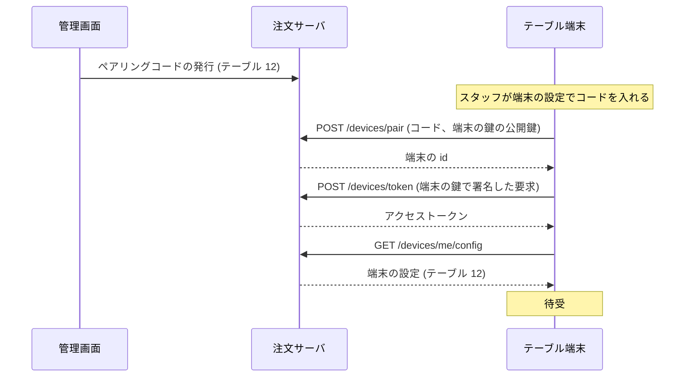
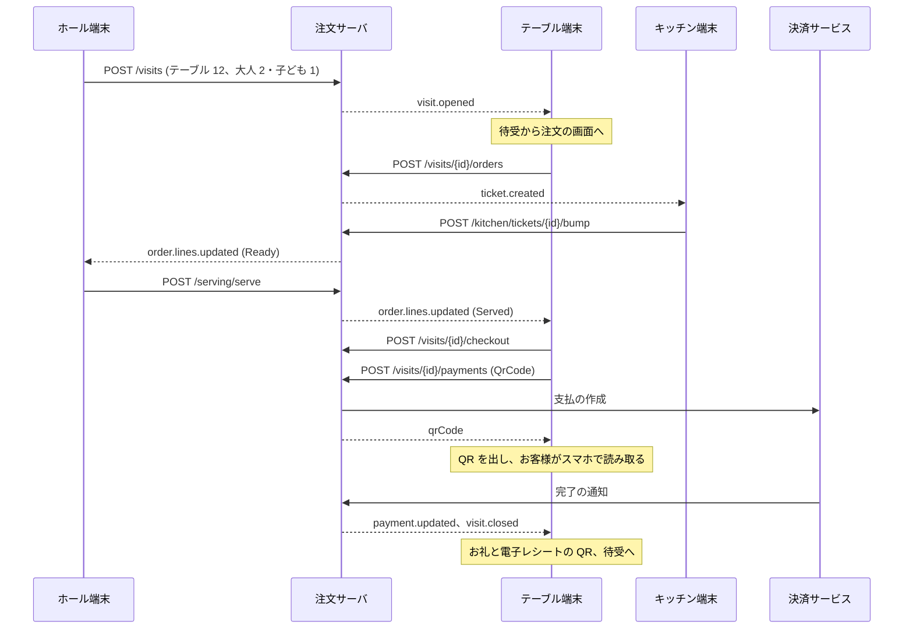

# 業務の前提と流れ

注文サーバと店の端末が前提にする業務 (店、端末、来店、会計) と、業務の流れ。  
API は [api-design.md](api-design.md)、データベースは [database.md](database.md)、作りは [architecture.md](architecture.md)、端末の配り方は [device-management.md](device-management.md) を参照。

- [1. 前提](#-1-前提)
- [2. 端末と業務](#-2-端末と業務)
- [3. 来店](#-3-来店)
- [4. 業務の流れ](#-4-業務の流れ)
- [5. 金額と税](#-5-金額と税)
- [6. 扱わないもの](#-6-扱わないもの)

---

## 📐 1. 前提

| 項目 | 内容 |
| --- | --- |
| 業態 | ファミリーレストランのチェーン。店内飲食だけ |
| 範囲 | 注文と、注文に関わる店内の業務 (来店の開始、調理、提供、呼び出し、品切れ、テーブルでの会計) |
| テナント | 複数の会社が契約して使う。テナントの中に店舗を持ち、端末は 1 つの店舗に属する ([API の決まり](api-design.md#16-テナント)) |
| 利用者 | テーブル端末 (お客様) / ホール端末 (スタッフのハンディ) / キッチン端末 (KDS) / 受付機 (任意) / 外部 (本部の管理システム、POS、決済サービス)。店舗と端末の設定は管理画面 (サーバの中の Web の画面) で行う |
| 来店 | テーブルの開始から会計までを 1 つの来店とし、その中に注文が何回か入る。人数は来店に持つ |
| 金額 | 価格は税込 (総額表示)。店内飲食の税率 10% で、会計のときに税率ごとに税額を出す ([5. 金額と税](#-5-金額と税)) |
| 会計 | テーブル端末で行う (QR コード決済、クレジットカード)。現金はレジ |
| 言語 | 日本語と英語。メニューの名前と説明、呼び出しの用件は両方の言語で返す |
| 特例 | ドリンクバー、お酒、キッズ、数量限定などは、商品とオプションのタグとメニューのルールで表す ([API のメニュー](api-design.md#-23-メニュー-menu)) |
| 通知 | 状態の変化はサーバから端末へすぐに知らせる ([API の通知](api-design.md#-3-リアルタイム通知)) |

---

## 🧩 2. 端末と業務

| 端末 | 使う人・置き場所 | 業務 |
| --- | --- | --- |
| テーブル端末 | お客様 (各テーブル) | メニューを見る、注文、注文履歴、食後の品のお願い、店員の呼び出し、テーブルでの会計、来店の開始 (来店の開き方が席の店) |
| ホール端末 | ホールのスタッフ (スマートフォン) | 来店の開始 (人数)、人数の変更、テーブルの移動、呼び出しの対応、提供、取消、品切れ、注文の一時停止、代わりの注文 (確認のルールはスタッフがお客様に確かめて記録する)、レジで払った来店の終了 |
| キッチン端末 | 厨房・デザート・ドリンクの持ち場 | チケットの表示、作り始め・できあがり・下げる、品切れ |
| 受付機 (任意) | お客様 (入口) | 人数を入れて来店を開き、席を案内する (来店の開き方が受付機の店。席はサーバが空席から決める) |
| 外部 | 本部の管理システム、POS、決済サービス | メニューの公開、来店の明細と支払の受け取り、決済の完了の通知 |
| 管理画面 | 店長・本部 (サーバの中の Web の画面) | 店舗の設定、テーブル、端末の登録と割り当て、外部のクライアントと Webhook (API を通さない。[管理画面](#管理画面)) |

### 管理画面

管理画面はサーバ (`TableOrder.Server.Web`) の中の Web の画面で、API を通さずに業務の処理を直接呼ぶ。  
利用者はテナントに属して自分のテナントだけを扱い、サービスの運営者はテナントを選んで扱う。

| 画面 | できること |
| --- | --- |
| チェーン | チェーンの名前、ロゴ、色 (テナントのすべての店舗のテーブル端末に出す) |
| 店舗 | 営業時間とラストオーダー、注文の上限、支払方法、呼び出しの用件、電子レシート、機能の有無 (レジでの会計、割り勘、ラストオーダーの知らせ、お礼の画面の時間)、言語、スタッフの PIN |
| テーブル | 追加、名前、席の数、並び、使わなくする |
| 端末 | ペアリングコードと登録トークンの発行、置き場所 (テーブル、持ち場) の割り当て、無効化、状態 (電池、最後の通信、アプリの版) |
| 外部 | 外部のクライアントの発行と無効化、Webhook の送り先 |
| 店内の今 | テーブルと来店、注文と明細の状態、呼び出し、品切れ、通知の記録 |
| 案内 (仮) | テーブルの一覧と、来店を開く (人数)・閉じる (レジで払った)・取りやめ (ホール端末と同じ処理) |
| テナント (運営者だけ) | テナントの登録と停止、専用の環境への移し替え |

---

## 🪑 3. 来店

### 3.1 来店と人数

来店の開き方は店舗の設定で選ぶ。  
どの形でも、ホール端末からは来店を開ける (席の決め直しや、困ったときのため)。

| 来店の開き方 | 流れ |
| --- | --- |
| スタッフ (既定) | 入口でスタッフが人数を聞いて席を決め、ホール端末で来店を開く |
| 受付機 | お客様が受付機で人数を入れると、サーバが人数の入る空席を決めて来店を開き、受付機が席を案内する。空席がなければ満席を出し、スタッフが引き継ぐ |
| 席 | お客様が空いている席に座り、テーブル端末の待受で人数を入れて始める |

- 人数は来店を開くときに入れる。  
  来店がテーブルに結び付くと、テーブル端末が待受から注文の画面になる
- テーブル端末の登録 (一度だけ。端末を店舗とテーブルに結び付ける) と、来店の開始 (来店ごと) は別のもの
- 管理画面にも仮の案内の画面を置き、ホール端末と同じ処理で来店を開き、閉じる (開発の環境で使う)
- 人数は、客数 (客単価の分母)、ドリンクバーの人数分の提案、キッズメニューの表示、割り勘の目安に使う

### 3.2 来店の状態

```
(なし) --来店の開始--> Open --会計を始める--> Paying --支払が揃う--> Closed
                        ^                        |
                        +------会計をやめる-------+
Open --注文のないまま帰った--> Cancelled
Open / Paying --レジで払った (ホール / POS)--> Closed
```

- テーブル端末は、自分のテーブルに `Open` か `Paying` の来店があるときだけ注文の画面を出し、ないときは待受にする
- `Paying` の間は注文を受け付けない (会計の明細が変わらないように)

---

## 🔁 4. 業務の流れ

### 4.1 端末を置くまで



- EMM で配るときは、ペアリングコードの代わりに登録トークン (店舗と種類に限った数日有効のもの) を管理対象の構成で配り、端末が起動したときに自分で登録する。  
  テーブルは管理画面で割り当て、端末は割り当てを待ってから待受になる
- 席替えで端末を別のテーブルに置くときは、管理画面で割り当てを替える (端末は登録し直さない)
- 端末を無効にすると、端末は登録を消して端末の設定に戻る。  
  テナントを止めると、端末は起動の画面で止まっていることを出し、再開を待つ

### 4.2 着席から会計まで



- 図は来店の開き方がスタッフの店。  
  受付機の店は受付機がテーブルを省いて `POST /visits` を送り (席はサーバが決める)、席の店はテーブル端末が待受で `POST /visits` を送る。  
  そのあとの流れは同じ

---

## 🧮 5. 金額と税

- 価格は税込 (総額表示) で持ち、店内飲食の税率 10% で計算する
- 明細: `unitPrice = 商品の price + Σ オプションの priceDelta`、`amount = unitPrice × quantity`
- 会計: 税率ごとに `taxableAmount = Σ amount`、`taxAmount = 端数処理 (taxableAmount × rate ÷ (1 + rate))` (内税。端数処理は店舗の `taxRounding`、既定は切り捨て)。  
  レシートには税率ごとの対象額と税額を出す (適格簡易請求書)
- 割り勘の目安: `base = Floor(total ÷ guests)`、余り `total − base × guests` 円を先頭の人から 1 円ずつ足す
- 端末は表示のために同じ計算をし、サーバは注文と会計で計算し直して確かめる

計算例 (大人 2・子ども 1):

| 明細 | 単価 | 数量 | 金額 |
| --- | ---: | ---: | ---: |
| チーズインハンバーグ (999) + ライス・スープ (330) + セットドリンクバー (299) | 1,628 | 2 | 3,256 |
| いちごパフェ (食後) | 699 | 1 | 699 |
| ドリンクバー (単品) | 459 | 1 | 459 |
| 合計 | | | **4,414** |

- 税 (内税 10%): `Floor(4,414 × 0.10 ÷ 1.10)` = **401**
- 割り勘の目安 (3 人): `Floor(4,414 ÷ 3)` = 1,471、余り 1 円 → **1,472 / 1,471 / 1,471**
- ドリンクバー: `drink-bar` のタグの品はセットのオプション 2 + 単品 1 = 3 で、人数分なので提案しない

---

## 🚫 6. 扱わないもの

POS の一般の業務と、注文に関わらない店舗・本部の業務は扱わない。  
注文サーバとつなぐところがあるものは、つなぎ方を書いた。

| 範囲 | 扱わないこと | 置き場所・つなぎ方 |
| --- | --- | --- |
| メニューのマスタ管理 | 商品・価格・写真・英語の訳の入力、時間帯の設定、店舗ごとの出し分け | 本部の管理システム。公開した結果を `POST /menu/publications` で受け取る |
| POS の一般の業務 | 売上の締め、日報、レジの開閉と現金、売上の分析 | POS。来店の明細と支払を Webhook (`visit.closed`) で渡す |
| 決済の処理 | 決済サービスとの契約と接続、カードの情報、返金、売上の確定 | 決済サービスと決済端末。注文サーバは支払の開始と結果の記録だけ |
| 現金の会計 | テーブルでの現金の受け渡し | レジで払い、POS かホール端末が来店を終える (`POST /visits/{id}/close`) |
| レシートと領収書の印刷 | 紙のレシート、宛名のある領収書 | 電子レシートの URL だけを返す。紙はレジ |
| 品ごとの割り勘 | 明細を人ごとに分けた会計 | 人数で割った目安と、額を分けた複数の支払だけ |
| 値引・クーポン・ポイント・会員 | 会員の認証、クーポン、ポイントの付与と利用 | 会員・販促のシステム (将来の拡張) |
| 予約・順番待ち | 受付の発券、順番の呼び出し、席が空くまでの待ち | 予約・受付のシステム。注文サーバは来店の開始 (受付機の店は空席の割り当てまで) だけ |
| 大人数の席 | 2 つ以上のテーブルをまとめて 1 つの来店で使う | スタッフが大きいテーブルに案内する (来店 1 つにテーブル 1 つ) |
| 持ち帰り・デリバリー・モバイルオーダー | お客様のスマホからの注文、持ち帰りの税率 (8%) | 店内飲食 (10%) だけを扱う |
| 食材の在庫と発注 | 原材料の在庫、仕入れ | 品切れ (売れるかどうか) だけを扱う |
| スタッフの管理 | スタッフの登録、PIN、権限、勤怠 | 操作の記録に `staffId` を任意で付けるだけ |
| キッチンプリンタ | 伝票の印刷とプリンタの制御 | キッチン端末 (KDS) を前提にする |
| 配膳ロボット | 配膳の依頼と到着の連絡 | 将来の拡張 (できあがった明細を渡す形になる) |
| 時間制のコース | 食べ放題・飲み放題の制限時間 | ファミリーレストランでは使わない (ドリンクバーは時間を区切らない) |
| 分析・レポート | 時間帯の売れ方、提供までの時間、呼び出しへの応答の時間 | 通知と記録から別に集計する |
| テナントをまたぐもの | テナントをまたぐ集計、メニューや設定の共有、テナントの中のブランド・地域の階層 | テナントごとに閉じる。チェーンはテナントと同じ単位にし、名前・ロゴ・色はチェーンの設定で替える |
