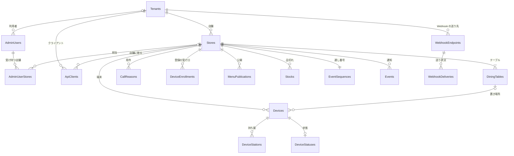
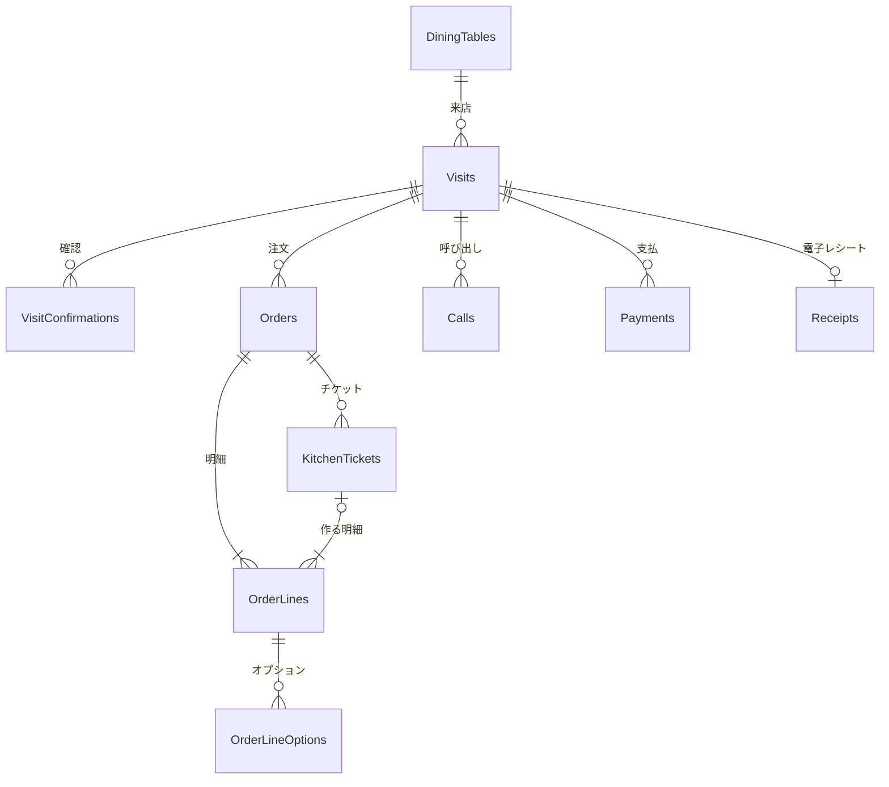

# データベース設計

注文サーバ (`TableOrder.Server.Core`) が持つデータの設計。  
スキーマ (`server/src/TableOrder.Server.Web/Assets/Data/Schema.sql`) はこの文書のすべての表を作り、サーバの起動のたびに実行する。  
外部の連携の表 (`ApiClients`、`WebhookEndpoints`、`WebhookDeliveries`) は作ってあり、読み書きは外部の連携を作るときに足す ([backlog.md](backlog.md))。  
業務の前提は [business.md](business.md)、API は [api-design.md](api-design.md)、本番のデータベースへの移し方は [plan.md](plan.md#-本番の環境) を参照。

- [1. 前提](#-1-前提)
- [2. 表の一覧](#-2-表の一覧)
- [3. テナントと店舗](#-3-テナントと店舗)
- [4. 端末と外部のクライアント](#-4-端末と外部のクライアント)
- [5. メニューと品切れ](#-5-メニューと品切れ)
- [6. 来店と注文](#-6-来店と注文)
- [7. 調理と呼び出し](#-7-調理と呼び出し)
- [8. 会計](#-8-会計)
- [9. 通知](#-9-通知)
- [10. 書き込みの決まり](#-10-書き込みの決まり)
- [11. 残す期間](#-11-残す期間)

---

## 📐 1. 前提

| 項目 | 内容 |
| --- | --- |
| データベース | 開発と今のサーバは SQLite。本番は Amazon RDS にする (エンジンと移し方は [plan.md](plan.md#-本番の環境))。型と SQL は他のデータベースに移しやすいもの (部分索引、`RETURNING`) にする |
| 範囲 | 複数のテナント (契約した会社) の店舗 ([api-design.md](api-design.md#16-テナント))。すべてのテナントのデータを 1 つのデータベースに置き、表ごとに `TenantId` で分ける ([テナントの持ち方](#テナントの持ち方))。店舗ごとのデータは `StoreId` も持つ |
| データの正 | 来店・注文・調理・提供・呼び出し・テーブルでの会計の正はこのデータベース。メニューの正は本部の管理システム (公開された内容を写して持つ)、売上の正は POS |
| 名前 | 表は複数形、列は PascalCase (行の型のプロパティと同じ名前)。テーブル (席) の表は SQL の表と紛れないように `DiningTables` にする |
| 時刻 | UTC で持ち、サーバの時計で付ける (端末の時刻は使わない)。営業時間とラストオーダーは店舗の現地時刻の `HH:mm`、営業日は来店を開いたときに決めて持つ |
| 消し方 | 業務のデータは状態 (取消、無効) で表して消さず、残す期間を過ぎたものだけを消す ([§11](#-11-残す期間)) |
| 長さ | 文字の長さは API の検証で確かめ、データベースでは決めない |

型:

| 型 | SQLite | C# | 中身 |
| --- | --- | --- | --- |
| `guid` | TEXT | `Guid` | 小文字のハイフン付き (`D` 形式) |
| `string` | TEXT | `string` | |
| `int` | INTEGER | `int` / `long` | |
| `bool` | INTEGER | `bool` | `0` / `1` |
| `money` | NUMERIC | `decimal` | 円の整数。価格は税込 |
| `rate` | NUMERIC | `decimal` | `0.10` = 10% |
| `datetime` | TEXT | `DateTimeOffset` | UTC の `yyyy-MM-dd HH:mm:ss.fffffff` |
| `date` | TEXT | `DateOnly` | `yyyy-MM-dd` |
| `time` | TEXT | `string` | 店舗の現地時刻の `HH:mm` |
| `enum` | TEXT | 列挙型 | 列挙名 (`Open`) |
| `LocalizedText` | TEXT | `LocalizedText` | 言語ごとの文字の JSON (`{"ja": "...", "en": "..."}`) |
| `json` | TEXT | 型ごと | まとめて読み書きするもの (公開されたメニュー、通知の `data`、値の一覧) |
| `bytes` | BLOB | `byte[]` | ハッシュ |

列の表の型の `?` は null になる列。

### テナントの持ち方

`Tenants` と管理画面の利用者 (`AdminUsers`) のほかのすべての表に `TenantId` を持たせ、すべてのテナントのデータを 1 つのデータベースに置く。  
`AdminUsers` は運営者 (テナントに属さない) を含むので、`Tenants` と同じくテナントの外の表にし、テナントの利用者だけが `TenantId` を持つ。

- 読み書きは、要求の文脈 (トークン) のテナントで必ず絞る (`AND TenantId = ...`)。  
  すべての SQL にテナントの条件を書き、書き忘れは SQL のファイルを調べるテストで見つける
- 主キー・一意・索引は、先頭に `TenantId` を置く (各表の箇条書きでは省いて書く。主キーを書いていない表は `TenantId`、`Id`)
- 外部キーも `TenantId` を含めて親の表を指し、子と親のテナントが食い違わないようにする
- テナントのわからない要求で引く列は、`TenantId` を付けずにすべてのテナントで一意にする (端末の `Id`、ペアリングコード、登録トークン、クライアントの `Id`、決済の取引番号、電子レシートの `Token`、管理画面の利用者のメールアドレス)。  
  ここで引いた行のテナントを、その後の処理の文脈にする
- テナントをまたいで読むのは、裏の処理 (通知の送り手、Webhook の送り直し、古いデータの消去) と運営者の管理画面だけにする。  
  その SQL は置き場所を分けてテナントの条件を調べるテストから外し、索引には `TenantId` を付けない (`Events` の `OccurredAt`、`WebhookDeliveries` の `NextAttemptAt`)
- 本番のデータベースが行のセキュリティ (RLS) を持つなら、テナントの条件をデータベースでも掛ける
- 大きなテナントを別のデータベースに移すときは、同じスキーマのデータベースに、そのテナントの行を移す (`TenantId` で行を選べる)

---

## 📋 2. 表の一覧

| 区分 | 表 | 内容 | 書くところ |
| --- | --- | --- | --- |
| テナント | `Tenants` | 契約した会社 (使える、止めた、解約した) | 運営者の管理画面 |
| 店舗 | `Stores` | 店舗と店舗の設定 (営業時間、注文の一時停止、注文の上限、支払方法) | 管理画面、`PUT /store/ordering` |
| | `CallReasons` | 呼び出しの用件 | 管理画面 |
| | `DiningTables` | テーブル (席) | 管理画面 |
| 管理画面 | `AdminUsers` | 管理画面の利用者 (役割、パスワードのハッシュ、多要素)。運営者はテナントに属さない | 管理画面 (サインイン、利用者の管理) |
| | `AdminUserStores` | 店舗の担当が受け持つ店舗 | 管理画面 |
| 端末 | `Devices` | 登録した端末 (種類、置き場所、公開鍵) | `POST /devices/pair`、管理画面 |
| | `DeviceStations` | キッチン端末が受け持つ持ち場 | `POST /devices/pair`、管理画面 |
| | `DeviceStatuses` | 端末の状態 (電池、アプリの版、最後の通信) | `POST /devices/me/heartbeat`、ハブの接続 |
| | `DeviceEnrollments` | ペアリングコードと登録トークン | 管理画面 (発行)、`POST /devices/pair` (使う) |
| 外部 | `ApiClients` | 外部 (本部、POS) のクライアント | 管理画面 |
| | `WebhookEndpoints` | Webhook の送り先 | 管理画面 |
| | `WebhookDeliveries` | Webhook の送り状況 | 通知の送り手 |
| メニュー | `MenuPublications` | 本部が公開したメニュー (公開の内容をそのまま) | `POST /menu/publications` |
| | `Stocks` | 品切れと残りの数 (`Available` でないものだけ) | `PUT /stock/{targetId}`、`POST /stock/reset`、注文 |
| 来店 | `Visits` | 来店 (テーブル、人数、状態) | 来店の API、会計 |
| | `VisitConfirmations` | 確認のルールに答えた記録 | `POST /visits/{id}/confirmations` |
| 注文 | `Orders` | 注文 (1 回の確定) | `POST /visits/{id}/orders` |
| | `OrderLines` | 明細 (注文したときの名前と価格、調理と提供の状態) | 注文、キッチン、提供、取消 |
| | `OrderLineOptions` | 明細で選んだオプション | 注文 |
| 調理 | `KitchenTickets` | 持ち場ごとのチケット | 注文、食後の品のお願い、キッチン |
| 呼び出し | `Calls` | 呼び出し | `POST /visits/{id}/calls`、ホール |
| 会計 | `Payments` | 支払 | `POST /visits/{id}/payments`、決済の結果 |
| | `Receipts` | 電子レシート | 支払が揃ったとき |
| 通知 | `EventSequences` | 店舗ごとの通知の通し番号 | 状態を変えるすべての書き込み |
| | `Events` | 通知 (つなぎ直しの追いつきのために 24 時間残す) | 状態を変えるすべての書き込み |

`Tenants` はすべての表から指されるので、図ではテナントの直下の表への線だけを書いた。

テナント・店舗・端末・メニュー:

来店から会計まで:

---

## 🏪 3. テナントと店舗

### Tenants (テナント)

| 列 | 型 | 中身 |
| --- | --- | --- |
| `Id` | guid | |
| `Code` | string | テナントのコード (運営と契約で使う) |
| `Name` | string | 会社の名前 (管理画面に出す) |
| `BrandName` | LocalizedText | チェーンの名前 (テーブル端末に出す) |
| `LogoImageName` | string? | ロゴの画像の名前 (画像の置き場。正方形で地の色を含む) |
| `Theme` | json? | 替える色 (`[{ "role": "PrimaryColor", "color": "#1E5FA8" }]`。ない役割は端末の既定) |
| `Status` | enum | `Active` / `Suspended` (契約を止めた) / `Closed` (解約した) |
| `SuspendedAt` / `ClosedAt` | datetime? | |
| `CreatedAt` / `UpdatedAt` | datetime | |
| `Version` | int | 管理画面の編集の楽観ロック |

- 主キー: `Id`、一意: `Code` (この表だけは `TenantId` を持たない)
- チェーンはテナントと同じ単位にし、チェーンの設定 (`BrandName`、`LogoImageName`、`Theme`) を替えたらテナントのすべての店舗の `SettingsVersion` を上げる
- サーバは止めたテナントの一覧を覚えて要求ごとに拒み、`Status` を替えたら一覧も替える

### Stores (店舗)

| 列 | 型 | 中身 |
| --- | --- | --- |
| `TenantId` | guid | テナント (キーの先頭) |
| `Id` | guid | |
| `Code` | string | 店舗コード (POS と合わせる) |
| `Name` | LocalizedText | |
| `TimeZone` | string | `Asia/Tokyo` |
| `OpenTime` / `CloseTime` | time | 開店の時刻を営業日の区切りにし、閉店が開店より前なら日をまたぐ |
| `LastOrderTime` | time? | ラストオーダーのない店は null |
| `OrderingPaused` | bool | 注文の一時停止 |
| `PausedMessage` | LocalizedText? | 一時停止の間にテーブル端末に出す文言 |
| `TaxRounding` | enum | `Floor` / `Round` / `Ceiling` |
| `MaxQuantityPerLine` / `MaxLinesPerOrder` | int | 1 明細の数量と、1 回の注文の明細の上限 |
| `Languages` | json | 画面で選べる言語 (`["ja", "en"]`) |
| `PaymentMethods` | json | テーブルで使える支払方法 (`["QrCode", "CreditCard"]`) |
| `ElectronicReceipt` | bool | 電子レシートを出すか |
| `Features` | json | 機能の有無 (`{ "registerCheckout": true, "splitPayment": true, "lastOrderNoticeMinutes": 30, "finishSeconds": 30, "visitOpening": "Hall", "kitchenAlertMinutes": 15, "daypartGraceMinutes": 2 }`)。増えていくので列にせず、ない項目は既定の値にする |
| `StaffPinHash` | json | スタッフの PIN のハッシュ (`{ "iterations": 100000, "salt": "...", "hash": "..." }`。PBKDF2-HMAC-SHA256)。平文は持たない |
| `SettingsVersion` | int | チェーンと店舗の設定の版。設定 (チェーン、店舗、テーブル) を替えるたびに上げる (端末が読み直すかを決める。店舗の行の編集の `Version` と分ける) |
| `MenuPublicationId` | guid? | 今のメニュー |
| `IsActive` | bool | |
| `CreatedAt` / `UpdatedAt` | datetime | |
| `Version` | int | 管理画面の編集の楽観ロック (注文の一時停止では上げない) |

- 一意: `Code`
- `GET /store` と `GET /devices/me/config` は、この行と `CallReasons` (と、端末の設定はテナントのチェーンの設定) から作る。  
  営業日 (`businessDate`) は今の時刻と `OpenTime` から求める

### CallReasons (呼び出しの用件)

| 列 | 型 | 中身 |
| --- | --- | --- |
| `TenantId` | guid | テナント (キーの先頭) |
| `StoreId` | guid | |
| `Code` | string | `Staff`、`Water` など |
| `Name` | LocalizedText | |
| `SortOrder` | int | |
| `IsActive` | bool | |

- 主キー: `StoreId`、`Code`

### DiningTables (テーブル)

| 列 | 型 | 中身 |
| --- | --- | --- |
| `TenantId` | guid | テナント (キーの先頭) |
| `Id` | guid | |
| `StoreId` | guid | |
| `Name` | string | `12` |
| `Area` | string? | `窓側`、`2F` |
| `Capacity` | int | 席の数 |
| `SortOrder` | int | |
| `IsActive` | bool | 使わなくなったテーブル (来店の記録が指すので消さない) |
| `CreatedAt` / `UpdatedAt` | datetime | |
| `Version` | int | |

- 一意: `StoreId`、`Name`
- `GET /tables` の来店の要約 (`visit`) は、開いている来店と、その明細 (まだ出していない品) と呼び出し (終わっていないもの) から求める

### AdminUsers (管理画面の利用者)

| 列 | 型 | 中身 |
| --- | --- | --- |
| `Id` | guid | |
| `TenantId` | guid? | 属するテナント (運営者は null) |
| `Role` | enum | `Operator` (運営者) / `TenantAdmin` (テナントの管理者) / `StoreStaff` (店舗の担当) |
| `Email` / `NormalizedEmail` | string | サインインの名前 (メールアドレス) と、大文字にそろえたもの |
| `Name` | string | 画面に出す名前 |
| `PasswordHash` | string | パスワードのハッシュ (ASP.NET Core Identity の形式。PBKDF2)。平文は持たない |
| `MustChangePassword` | bool | 管理者が出した仮のパスワード (次のサインインで替えさせる) |
| `SecurityStamp` | string | 資格情報 (パスワード、役割、受け持つ店舗、多要素、止める) を替えたら替える印。開いている管理画面は 1 分のうちにやり直す |
| `AccessFailedCount` / `LockoutEnd` | int / datetime? | 続けて間違えた回数と、止めている期限 (5 回で 15 分) |
| `TwoFactorEnabled` | bool | 多要素 (認証アプリ) を使う |
| `AuthenticatorKey` | string? | 認証アプリの鍵 (データ保護で暗号にしたもの) |
| `RecoveryCodes` | json? | 回復用のコードのハッシュ (`["..."]`。使ったら除く) |
| `LastSignInAt` | datetime? | |
| `IsActive` | bool | 止めた利用者 (サインインできない。消さない) |
| `CreatedAt` / `UpdatedAt` | datetime | |
| `Version` | int | 資格情報と管理画面の編集の楽観ロック |

- 主キー: `Id`、一意: `NormalizedEmail` (サインインはテナントのわからないまま引くので、すべてのテナントで一意)、一意: `TenantId`、`Id` (`AdminUserStores` から指す)
- 運営者はテナントに属さないので、`Tenants` と同じくテナントの外の表にする。  
  サインインと自分の資格情報の読み書きは利用者の `Id` かメールアドレスで引き、テナントの利用者の一覧と管理はテナントで絞る

### AdminUserStores (店舗の担当が受け持つ店舗)

| 列 | 型 | 中身 |
| --- | --- | --- |
| `TenantId` | guid | テナント (キーの先頭) |
| `UserId` | guid | 利用者 (店舗の担当) |
| `StoreId` | guid | 受け持つ店舗 |

- 主キー: `UserId`、`StoreId`

---

## 📱 4. 端末と外部のクライアント

### Devices (端末)

| 列 | 型 | 中身 |
| --- | --- | --- |
| `TenantId` | guid | テナント (キーの先頭) |
| `Id` | guid | 登録のときにサーバが採番 |
| `StoreId` | guid | |
| `Kind` | enum | `Table` / `Hall` / `Kitchen` / `Reception` |
| `Name` | string | `T12`、`ハンディ 1`、`キッチン 1` |
| `TableId` | guid? | テーブル端末の置き場所 |
| `PublicKey` | string | 端末の公開鍵 (JWK。座標は読み直した値で書き、同じ鍵は同じ文字列にする)。トークンの要求の署名を確かめる |
| `IsActive` | bool | 無効にすると次のトークンを出さず、出したトークンもすぐに拒む |
| `RegisteredAt` | datetime | |
| `RevokedAt` | datetime? | 無効にした時刻 (トークンの期限を過ぎるまで、すぐに拒む一覧に入れる) |
| `CreatedAt` / `UpdatedAt` | datetime | |
| `Version` | int | |

- すべてのテナントで一意: `Id` (トークンの要求で、テナントのわからないまま端末を引く)
- 索引: `StoreId`、`RevokedAt` (無効にした行だけ。すぐに拒む一覧で、テナントをまたいで近ごろ無効にした端末を引く)、`PublicKey` (登録し直した端末の前の登録を、テナントのわからないまま引く)
- 同じ鍵で登録し直した端末が新しい登録でトークンを受け取ると、前の登録 (同じ `PublicKey` の有効な行) を無効にする
- 名前は端末が送った名前 (機種の名前と端末ごとの値の末尾) で、重なってよい (管理画面で付け替える)
- 置き場所 (テーブル、持ち場) を替えても登録し直さない (次のトークンと端末の設定に出る)

### DeviceStations (キッチン端末の持ち場)

| 列 | 型 | 中身 |
| --- | --- | --- |
| `TenantId` | guid | テナント (キーの先頭) |
| `DeviceId` | guid | |
| `StationId` | guid | メニューの持ち場 (`stations`) の Id |

- 主キー: `DeviceId`、`StationId`
- 持ち場はメニューと一緒に本部が決めるので、表にせず公開されたメニューの Id を指す (本部は公開し直しても持ち場の Id を変えない)

### DeviceStatuses (端末の状態)

| 列 | 型 | 中身 |
| --- | --- | --- |
| `TenantId` | guid | テナント (キーの先頭) |
| `DeviceId` | guid | |
| `AppVersion` | string? | |
| `BatteryLevel` | rate? | 電池の残り (`0`〜`1`) |
| `IsCharging` | bool? | |
| `LastSeenAt` | datetime | 最後に通信した時刻 (状態の報告とハブの接続で替え、要求のたびには書かない) |

- 主キー: `DeviceId`
- 1 分ごとに書くので、端末の表と分ける (管理画面の編集の楽観ロックとぶつけない)

### DeviceEnrollments (端末の登録の受け口)

| 列 | 型 | 中身 |
| --- | --- | --- |
| `TenantId` | guid | テナント (キーの先頭) |
| `Id` | guid | |
| `StoreId` | guid | |
| `Kind` | enum | 登録する端末の種類 |
| `Method` | enum | `PairingCode` (管理画面で出す 6 桁。10 分、1 台) / `EnrollmentToken` (EMM で配る。数日、決めた台数まで) |
| `PairingCode` | string? | 6 桁の数字 (短命なのでそのまま持つ) |
| `TokenHash` | bytes? | 登録トークンの SHA-256 |
| `TableId` | guid? | ペアリングコードで決めるテーブル |
| `StationIds` | json? | ペアリングコードで決める持ち場 |
| `MaxUses` / `UsedCount` | int | 登録できる台数と、登録した台数 |
| `ExpiresAt` | datetime | |
| `CreatedAt` | datetime | |
| `RevokedAt` | datetime? | 取り消した時刻 (登録トークン) |

- すべてのテナントで一意: `PairingCode` (null でない行)、`TokenHash` (null でない行)
- ペアリングの要求はテナントも店舗も知らないので、コードから引いた行のテナントと店舗で端末を登録する。  
  期限を過ぎたコードは消す (同じコードを出し直せるように)
- 登録トークンは、期限を過ぎるか取り消してから 1 日で消す (それまでは管理画面の一覧に出す)

### ApiClients (外部のクライアント)

| 列 | 型 | 中身 |
| --- | --- | --- |
| `TenantId` | guid | テナント (キーの先頭) |
| `Id` | guid | `client_id` |
| `Name` | string | `本部`、`001 の POS` |
| `StoreId` | guid? | 店舗に限るクライアント (POS)。null はテナント全体 (本部) |
| `SecretHash` | bytes | `client_secret` の SHA-256 |
| `Scopes` | json | 使える範囲 (`menu.publish`、`visits.read`、`visits.close` など) |
| `IsActive` | bool | |
| `CreatedAt` | datetime | |
| `RevokedAt` | datetime? | |

- すべてのテナントで一意: `Id` (client credentials で、テナントのわからないままクライアントを引く)
- アクセストークンは `POST /oauth/token` (client credentials) で出し、`client_secret` はハッシュだけを持つ
- Webhook の送り先と送り状況は [§9](#-9-通知) に置いた

---

## 📖 5. メニューと品切れ

### MenuPublications (メニューの公開)

| 列 | 型 | 中身 |
| --- | --- | --- |
| `TenantId` | guid | テナント (キーの先頭) |
| `Id` | guid | |
| `StoreId` | guid | |
| `MenuVersion` | string | 公開のたびに変わる (公開の時刻と通し番号。`2026-10-01T02:00:00.000Z-17`)。`GET /menu` の `ETag` |
| `Content` | json | 公開されたメニュー (`MenuResponse` の形。時間帯と出せる条件のルールも含む) |
| `PublishedAt` | datetime | |
| `ApiClientId` | guid? | 公開した外部のクライアント |

- 一意: `StoreId`、`MenuVersion`
- メニューは本部が編集して丸ごと公開するので、商品やオプションの表に分けず、公開の内容をそのまま持つ。  
  サーバは店舗の今のメニューを読み込んで覚え (公開で替える)、`GET /menu` と注文の確かめ (価格、オプション、タグとルール、持ち場) に使う
- 料理の写真は画像の置き場 (テナントごと。開発はファイル、本番は Amazon S3) に置き、データベースにはメニューの `imageName` (画像の名前) だけを持つ

### Stocks (品切れ)

| 列 | 型 | 中身 |
| --- | --- | --- |
| `TenantId` | guid | テナント (キーの先頭) |
| `StoreId` | guid | |
| `TargetId` | guid | 商品かオプションの Id |
| `TargetKind` | enum | `Item` / `Option` |
| `Status` | enum | `Limited` / `SoldOut` |
| `Remaining` | int? | `Limited` の残りの数 |
| `UpdatedAt` | datetime | |

- 主キー: `StoreId`、`TargetId`
- `Available` に戻したら行を消し、`GET /stock` は行をそのまま返す。  
  メニューの公開で消えた商品とオプションの行も消す
- 残りの数は、注文を受けるときに `Remaining >= 数量` を条件に減らし、`0` になったら `SoldOut` にする (同時の注文で残りの数を超えない)

---

## 🪑 6. 来店と注文

### Visits (来店)

| 列 | 型 | 中身 |
| --- | --- | --- |
| `TenantId` | guid | テナント (キーの先頭) |
| `Id` | guid | 来店を開いた端末 (管理画面の案内はサーバ) が採番 |
| `StoreId` | guid | |
| `TableId` | guid | 移動で替わる |
| `BusinessDate` | date | 開いたときの営業日 |
| `Adults` / `Children` | int | 合わせて 1 以上 |
| `Status` | enum | `Open` / `Paying` / `Closed` / `Cancelled` |
| `OpenedBy` | enum | `Hall` (ホール端末と管理画面の案内) / `Reception` (受付機) / `Table` (テーブル端末) |
| `OpenedDeviceId` | guid? | 開いた端末 (管理画面の案内は null) |
| `OpenedAt` | datetime | |
| `ClosedBy` | enum? | `TablePayment` / `Register` / `Hall` |
| `ClosedAt` | datetime? | 閉じたか取りやめた時刻 |
| `ClosedStaffId` | string? | 閉じたスタッフ (任意。取りやめでは書かない) |
| `CreatedAt` / `UpdatedAt` | datetime | |
| `Version` | int | 来店の変更 (人数、移動、会計、閉じる、取りやめ) の楽観ロック (確認の記録では上げない) |

- 一意: `TableId` (`Status` が `Open` か `Paying` の行だけの部分索引)。  
  1 つのテーブルに開いている来店を 2 つ作らない (`TABLE_OCCUPIED`)
- 索引: `StoreId`、`BusinessDate`
- `VisitResponse` の `tableName` は `DiningTables`、`confirmedRuleIds` は `VisitConfirmations`、`orderTotal` は `OrderLines` (取消を除く) から求める

### VisitConfirmations (確認の記録)

| 列 | 型 | 中身 |
| --- | --- | --- |
| `TenantId` | guid | テナント (キーの先頭) |
| `VisitId` | guid | |
| `RuleId` | guid | メニューの確認のルールの Id |
| `DeviceId` | guid? | 答えた端末 |
| `ConfirmedAt` | datetime | |

- 主キー: `VisitId`、`RuleId`

### Orders (注文)

| 列 | 型 | 中身 |
| --- | --- | --- |
| `TenantId` | guid | テナント (キーの先頭) |
| `Id` | guid | 送った端末が採番 |
| `StoreId` | guid | |
| `VisitId` | guid | |
| `OrderNo` | int | 来店の中の通し番号 |
| `Source` | enum | `Table` / `Hall` |
| `DeviceId` | guid? | 送った端末 |
| `MenuVersion` | string | 表示していたメニュー |
| `RequestHash` | bytes | 要求の中身のハッシュ (同じ `id` で中身の違う送り直しを見つける) |
| `OrderedAt` | datetime | |

- 一意: `VisitId`、`OrderNo`
- `OrderNo` は、店舗の書き込みのロックの中で来店の最大の番号に 1 を足して採番する (店舗の書き込みは 1 つずつなので重ならない)
- 注文の合計 (`amount`) は列に持たず、明細 (取消を除く) から求める

### OrderLines (明細)

| 列 | 型 | 中身 |
| --- | --- | --- |
| `TenantId` | guid | テナント (キーの先頭) |
| `Id` | guid | 送った端末が採番 (数量の一部を取り消して分けた明細はサーバが採番) |
| `StoreId` | guid | |
| `OrderId` | guid | |
| `VisitId` | guid | 来店の明細をまとめて読むため |
| `LineNo` | int | 注文の中の並び |
| `ItemId` | guid | |
| `ItemCode` | string | 商品コード (POS に渡す) |
| `Name` | LocalizedText | 注文したときの名前 |
| `Tags` | json | 注文したときの商品とオプションのタグ (上限のルールを来店のこれまでの注文と合わせて数える) |
| `Quantity` | int | |
| `UnitPrice` | money | 税込。商品の価格 + オプションの差額 |
| `Amount` | money | `UnitPrice × Quantity` |
| `TaxRate` | rate | |
| `Timing` | enum | `Now` / `AfterMeal` |
| `Status` | enum | `Held` / `Ordered` / `Cooking` / `Ready` / `Served` / `Cancelled` |
| `StationId` | guid? | 作る持ち場 (null は作らない品) |
| `ServedBy` | enum | `Staff` / `Guest` |
| `TicketId` | guid? | キッチンのチケット (作る品で、お願いされたもの) |
| `ReleasedAt` | datetime? | 食後の品をお願いした時刻 |
| `StartedAt` / `ReadyAt` / `ServedAt` | datetime? | 作り始め、できあがり、提供 (提供までの時間の集計にも使う) |
| `ServedStaffId` | string? | 提供したスタッフ (任意) |
| `CancelledAt` | datetime? | |
| `CancelReason` | string? | |
| `CancelStaffId` | string? | 取り消したスタッフ (任意) |
| `SplitFromLineId` | guid? | 数量の一部を取り消したときの元の明細 |

- 索引: `OrderId`、`VisitId`、`TicketId`、`StoreId` (`Status` が `Ready` の行だけの部分索引。提供を待つ明細)
- 注文を受けたときの状態は、食後の品は `Held`、お客様がとる品は `Served`、作らない品でスタッフが運ぶものは `Ready`、ほかは `Ordered` にする
- 数量の一部の取消は、元の明細の数量を減らし、取り消した数量の明細 (`Cancelled`) を分けて作る

### OrderLineOptions (明細のオプション)

| 列 | 型 | 中身 |
| --- | --- | --- |
| `TenantId` | guid | テナント (キーの先頭) |
| `LineId` | guid | |
| `SortOrder` | int | 選んだ順 |
| `OptionGroupId` | guid | |
| `OptionId` | guid | |
| `Name` | LocalizedText | 注文したときの名前 |
| `PriceDelta` | money | 税込の差額 |

- 主キー: `LineId`、`OptionId`

---

## 🍳 7. 調理と呼び出し

### KitchenTickets (チケット)

| 列 | 型 | 中身 |
| --- | --- | --- |
| `TenantId` | guid | テナント (キーの先頭) |
| `Id` | guid | サーバが採番 |
| `StoreId` | guid | |
| `StationId` | guid | |
| `OrderId` | guid | |
| `VisitId` | guid | |
| `Status` | enum | `Open` / `Done` |
| `CreatedAt` | datetime | できた時刻 (食後の品はお願いされた時刻) |
| `DoneAt` | datetime? | 下げた時刻 |

- 索引: `StationId`、`Status`、`CreatedAt`
- 注文を受けたときに、すぐに出す品を持ち場ごとのチケットにする。  
  食後の品は、お願いされたとき (会計を始めたときは残りをすべて) に持ち場ごとのチケットにする
- テーブルの名前と注文の番号は、出すときに `Visits` と `Orders` から引く (来店がテーブルを移っても新しいテーブルを出す)

### Calls (呼び出し)

| 列 | 型 | 中身 |
| --- | --- | --- |
| `TenantId` | guid | テナント (キーの先頭) |
| `Id` | guid | テーブル端末が採番 |
| `StoreId` | guid | |
| `VisitId` | guid | |
| `ReasonCode` | string | 用件 (`CallReasons`) |
| `Status` | enum | `Open` / `Acknowledged` / `Done` |
| `DeviceId` | guid? | 呼んだ端末 |
| `CreatedAt` | datetime | |
| `AcknowledgedAt` / `DoneAt` | datetime? | |

- 一意: `VisitId`、`ReasonCode` (`Status` が `Done` でない行だけの部分索引)。  
  同じ用件の終わっていない呼び出しを増やさない
- 索引: `StoreId` (`Status` が `Done` でない行だけの部分索引。ホールの一覧)
- テーブルは来店から引く (来店が移ったら、移った先のテーブルを出す)

---

## 💳 8. 会計

### Payments (支払)

| 列 | 型 | 中身 |
| --- | --- | --- |
| `TenantId` | guid | テナント (キーの先頭) |
| `Id` | guid | テーブル端末が採番 |
| `StoreId` | guid | |
| `VisitId` | guid | |
| `Method` | enum | `QrCode` / `CreditCard` |
| `Amount` | money | |
| `Status` | enum | `Pending` / `Completed` / `Failed` / `Cancelled` |
| `QrCode` | string? | 店舗が見せる QR の内容 |
| `ExpiresAt` | datetime? | QR の期限 |
| `Provider` / `ProviderReference` | string? | 決済サービスと、その取引番号 |
| `FailureReason` | string? | |
| `DeviceId` | guid? | 払った端末 |
| `CreatedAt` / `UpdatedAt` | datetime | |
| `CompletedAt` | datetime? | |

- すべてのテナントで一意: `Provider`、`ProviderReference` (取引番号のある行)。  
  決済サービスの通知はこれで支払を引いてテナントを決め、2 回受けても 1 回にする
- 索引: `VisitId`
- 新しい支払は、合計から済んだ支払と期限内の待っている支払を引いた額までにする (割り勘で続けて始めても合計を超えない)

### Receipts (電子レシート)

| 列 | 型 | 中身 |
| --- | --- | --- |
| `TenantId` | guid | テナント (キーの先頭) |
| `VisitId` | guid | |
| `Token` | string | 電子レシートの URL に入れる推測できない値 |
| `IssuedAt` | datetime | |

- 主キー: `VisitId`
- すべてのテナントで一意: `Token` (電子レシートの画面で、テナントのわからないまま引く)
- 電子レシートを出す店 (`ElectronicReceipt`) だけ、支払が揃ったときに作る
- 電子レシートの画面は `Token` で来店を引いて会計の明細を出す (閉じた来店は変わらないので、明細を写さない)

---

## 📡 9. 通知

### EventSequences (通知の通し番号)

| 列 | 型 | 中身 |
| --- | --- | --- |
| `TenantId` | guid | テナント (キーの先頭) |
| `StoreId` | guid | |
| `LastSeq` | int | 最後に採番した `seq` |

- 主キー: `StoreId`
- 古い通知を消しても番号が戻らないように、通し番号は通知の表と分けて持つ

### Events (通知)

| 列 | 型 | 中身 |
| --- | --- | --- |
| `TenantId` | guid | テナント (キーの先頭) |
| `StoreId` | guid | |
| `Seq` | int | 店舗の中の通し番号 |
| `Type` | string | `visit.opened` など |
| `OccurredAt` | datetime | |
| `Data` | json | 通知の `data` |
| `TableIds` | json? | 送る先のテーブル (テーブル端末には、そのテーブルの通知だけを送る)。null は店舗のすべてのテーブル |
| `StationId` | guid? | 送る先の持ち場 (キッチン端末には、受け持つ持ち場の通知だけを送る)。null はすべての持ち場 |

- 主キー: `StoreId`、`Seq`
- 索引: `OccurredAt` (`TenantId` を付けない。テナントをまたいで古いものを消す)
- 送る先は、通知の種類ごとに決めた端末の種類と、`TableIds`・`StationId` で決める。  
  ハブの送り分けと `GET /events` で同じ判定を使う

### WebhookEndpoints (Webhook の送り先)

| 列 | 型 | 中身 |
| --- | --- | --- |
| `TenantId` | guid | テナント (キーの先頭) |
| `Id` | guid | |
| `Name` | string | |
| `Url` | string | |
| `Secret` | string | 署名 (HMAC-SHA256) の鍵。本番では暗号化して持つ |
| `EventTypes` | json | 送る通知の種類 |
| `StoreId` | guid? | 店舗に限る送り先。null は全店舗 |
| `IsActive` | bool | |
| `CreatedAt` / `UpdatedAt` | datetime | |
| `Version` | int | |

### WebhookDeliveries (Webhook の送り状況)

| 列 | 型 | 中身 |
| --- | --- | --- |
| `TenantId` | guid | テナント (キーの先頭) |
| `Id` | guid | |
| `EndpointId` | guid | |
| `StoreId` | guid | |
| `Seq` | int | 送る通知 |
| `Payload` | json | 送る本文 (古い通知を消しても送り直せるように写す) |
| `Status` | enum | `Pending` / `Succeeded` / `Abandoned` (送り直しの上限を超えた) |
| `Attempts` | int | |
| `NextAttemptAt` | datetime? | |
| `LastStatusCode` | int? | |
| `LastError` | string? | |
| `CreatedAt` | datetime | |
| `DeliveredAt` | datetime? | |

- 一意: `EndpointId`、`StoreId`、`Seq`
- 索引: `NextAttemptAt` (`TenantId` を付けない。`Status` が `Pending` の行だけの部分索引で、テナントをまたいで送り直す)

---

## 🔁 10. 書き込みの決まり

- 1 つの要求を 1 つのトランザクションで書く
- 店舗の中の状態を変える書き込みは、最初に店舗の `EventSequences` の行をロックして 1 つずつ行う。  
  来店の状態と注文・会計の確かめが食い違わず、通知の `seq` の順とコミットの順が揃う (店の規模なら待ちは短い)
- 状態を変えたら、同じトランザクションで `EventSequences` の `LastSeq` を増やして、`Events` に通知を書く。  
  コミットのあと、サーバごとの送り手が `Events` を店舗ごとに `seq` の順に読んで、ハブに送る。  
  送り手は、書いたサーバが知らせた店舗のほか、一定の間隔ですべての店舗の `LastSeq` を見て、ほかのサーバが書いた通知も送る
- 端末が採番する `id` (来店、注文、明細、呼び出し、支払) は主キーで重複を防ぐ。  
  同じ `id` の送り直しは書いた行を返し、主な項目が違えば `409` (`DUPLICATE_ID_MISMATCH`。注文は `RequestHash` で比べる)
- 楽観ロックの `Version` は、管理画面で編集する表 (`Tenants`、`Stores`、`DiningTables`、`AdminUsers`、`Devices`、`WebhookEndpoints`) と来店 (`Visits`) に持つ。  
  `AND Version = ...` を条件に更新し、`Version = Version + 1` にする
- 状態の変更は遷移元の状態を条件にして更新し (`AND Status = 'Ready'` など)、更新した行がなければ今の状態を読んで `422` か `409` を返す
- 名前・価格・タグは注文したときのものを明細に写し、注文履歴・チケット・会計はメニューを引かずに作る
- 会計の明細の版 (`billVersion`) は列に持たず、取消を除いた明細 (`Id`、数量、単価) から求める

---

## 🧹 11. 残す期間

| データ | 残す期間 | 消すとき |
| --- | --- | --- |
| `Events` | 24 時間 (つなぎ直しの追いつきの範囲。過ぎた要求は `EVENTS_EXPIRED`) | 古いデータを消す間隔 (`Cleanup:IntervalMinutes`、既定 1 時間) ごと |
| `DeviceEnrollments` | ペアリングコードは期限まで、登録トークンは期限を過ぎるか取り消してから 1 日 | 古いデータを消す間隔ごと |
| `Visits` と子の表 (`VisitConfirmations`、`Orders`、`OrderLines`、`OrderLineOptions`、`KitchenTickets`、`Calls`、`Payments`、`Receipts`) | 閉じた来店 (`Closed`、`Cancelled`) は、来店の営業日から 90 日 (`Cleanup:VisitRetentionDays`)。開いている来店 (`Open`、`Paying`) は消さない | 古いデータを消す間隔ごとに、店舗ごとに営業日の古い順に 200 件 (`Cleanup:VisitBatchSize`) ずつのトランザクションで、子の表から消す |
| `MenuPublications` | 店舗の今のメニュー (`Stores.MenuPublicationId`) と、公開の新しい順に 10 件 (`Cleanup:MenuPublicationsKept`) | 古いデータを消す間隔ごとに、店舗ごとに消す |

- 来店は営業日で数え、同じ営業日の来店をまとめて消す (集計と問い合わせの単位とそろえる)
- 店舗のデータの片付けは今の状態を変えないので、通知を書かない
- Webhook の送り状況と、解約したテナントの行を消す処理は作っていない (Webhook は外部の連携で、解約したテナントはテナントの解約と一緒に作る。[backlog.md](backlog.md))
